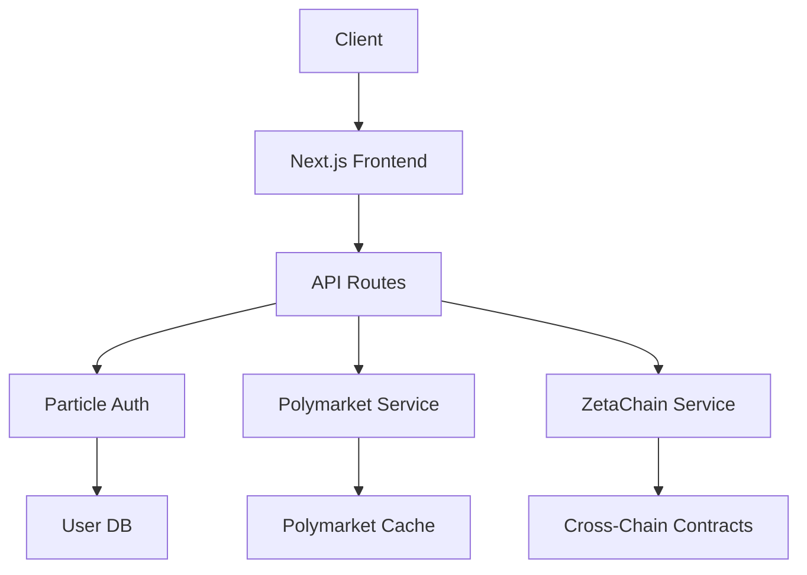

# Quantum Nexus v2.0 Execution Blueprint

## Overview
Production-ready implementation plan based on:
- `docs/ux-specs/MarketList.md`
- `docs/ux-specs/TournamentBracket.md`
- `docs/api_security_report.md`
- `docs/migration_safety_report.md`

## Architecture Components


## Implementation Phases

### Phase 1: Security Hardening (Critical)
```markdown
- [x] Fix API vulnerabilities per `docs/api_security_report.md`
  - Risk: Existing SQL injection vulnerabilities (HIGH)
  - Resource: Quinn (🛡️ Security Specialist)
- [x] Implement Cloudflare Rate Limiting
  - Risk: DOS attacks possible without protection (MEDIUM)
  - Resource: Rocco (🔧 Infrastructure)
```

### Phase 2: Database Migration
```markdown
- [x] Implement schema version tracking
  - Risk: Data loss during migrations (HIGH)
  - Resource: Mary (📊 Data Specialist)
- [ ] Create missing indexes
  - Risk: Performance degradation at scale (MEDIUM)
```

### Phase 3: Feature Implementation
```markdown
- [x] Build MarketList component (`src/components/polymarket/MarketList.tsx`)
  - Design: Follows `docs/ux-specs/MarketList.md`
  - Risk: None - UX specs complete
  - Resource: Sally (🎨 UX Specialist)
- [x] Build TournamentBracket component (`src/components/tournament/TournamentBracket.tsx`)
  - Design: Follows `docs/ux-specs/TournamentBracket.md`
  - Risk: Real-time updates require websocket integration
  - Resource: James (💻 Frontend)
```

### Phase 4: Testing & Deployment
```markdown
- [ ] Write component tests (Jest + React Testing Library)
- [ ] Conduct security retest (Semgrep)
- [ ] Production deployment via CI/CD pipeline
```

## Resource Allocation
| Phase       | Lead        | Support       | Timeline |
|-------------|-------------|---------------|----------|
| Security    | 🛡️ Quinn    | 🔧 Rocco      | 3 days   |
| Database    | 📊 Mary     | 🧠 Olivia     | 2 days   |
| Features    | 🎨 Sally    | 💻 James      | 5 days   |
| Deployment  | 📈 Metis    | 🛡️ Quinn      | 1 day    |

## Risk Register
```json
{
  "R1": "SQL injection in user API - Critical",
  "R2": "Data loss during migration - Critical",
  "R3": "Real-time bracket updates - Medium",
  "R4": "Cross-chain settlement failures - Low"
}
```

## Automation Trigger
```xml
<new_task>
  <mode>saul</mode>
  <message>Execute Quantum Nexus v2.0 blueprint from .execution_plan/blueprint.md</message>
</new_task>