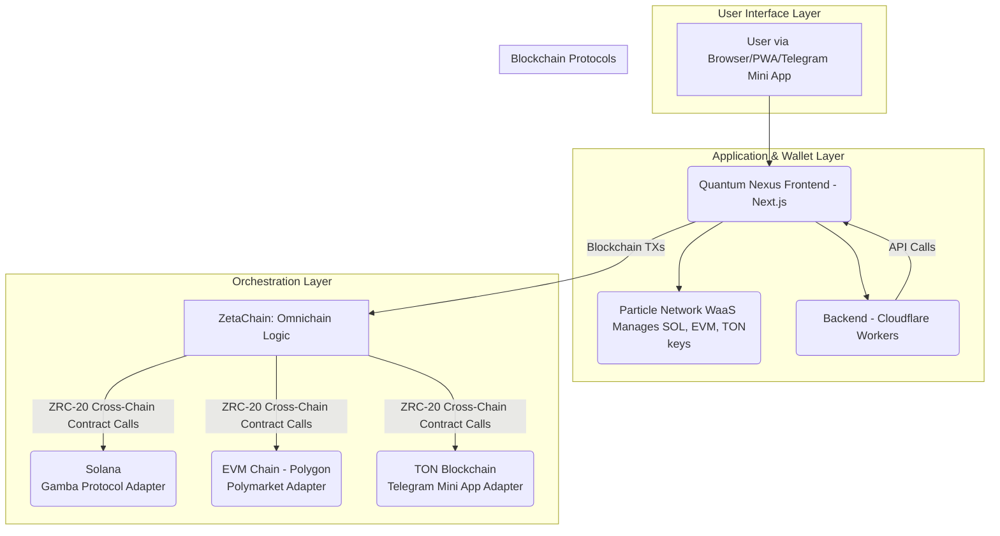

### FILE: 01-prd.md

# Product Requirements Document: Quantum Nexus

## 1. Project Overview

Quantum Nexus is a universal decentralized application (dApp) that unifies the fragmented landscape of decentralized gaming and prediction markets. It solves the high friction and technical barriers in the current dApp ecosystem by integrating premier platforms like Gamba (Solana) and Polymarket (EVM) into a single, fluid user experience orchestrated by ZetaChain. The core innovations are radical simplicity through Particle Network's social login Wallet-as-a-Service, and an AI-driven "Smart Bet" and viral growth engine to drive user acquisition and engagement.

## 2. User Stories

- As a new user, I want to sign up with my social account so that I can access the platform without needing to manage a crypto wallet myself.
- As a new user who just signed up, I want to receive a "First Play Free" credit so that I can try a game immediately without any risk.
- As a user, I want to see and play all available Gamba games within the new "Hyperspace Gateway" interface so that I have a variety of gaming options.
- As a user playing a Gamba game, I want a "Smart Bet" button that gives me a simple, AI-powered bet suggestion so that I can play with more confidence.
- As a user, I want to browse and view active prediction markets from Polymarket so that I can find opportunities to bet on.
- As a user, I want to connect my EVM wallet and place a bet on a Polymarket market so that I can participate in prediction markets.
- As a user, I want to see my open positions and a history of my past bets on Polymarket so that I can track my performance.
- As a user, I want to be rewarded for bringing friends to the platform and easily share my exciting wins so that I can benefit from growing the community.

## 3. Key Features

- **Social Onboarding:** User onboarding via social logins (Particle Network) that creates a self-custodial wallet.
- **First Play Free:** A one-time, micro-value credit for new users upon signup.
- **Gamba Game Suite:** Full integration of all available Gamba games with a consistent UI theme.
- **Polymarket Integration:** Full functionality to discover markets, analyze odds, place bets, and view open positions.
- **Gamified Referrals:** A referral system with user tiers and a public leaderboard.
- **Share a Bet:** A feature to generate and share a direct link to a game with winning parameters pre-filled.
- **Programmatic SEO (pSEO):** Automatically generate SEO-optimized landing pages based on Polymarket events.
- **Automated Social Posting:** Automatically post links to new pSEO pages on social media with AI-generated images.
- **Smart Bet AI:** A one-click AI suggestion feature on Gamba game pages.
- **Cross-Platform Support:** Configurable as a Progressive Web App (PWA) and deployable as a Telegram Mini App.
- **Multi-Language Support:** UI localized for at least 10 languages from launch.
- **Swappable AI Service Adapter:** Backend architecture to flexibly use different LLMs for different tasks.

## 4. Non-Functional Requirements

- **Cost-Effectiveness:** All infrastructure must be designed to operate within free or near-zero-cost tiers for the first 6 months.
- **Performance (Time to Wow):** The time from a user landing on the page to their first on-chain interaction must be under 3 minutes.
- **Performance (UI):** All primary UI animations and page transitions must maintain a consistent 60 FPS on modern devices.
- **Scalability:** The pSEO engine must be architected to scale to thousands of pages without a significant increase in manual oversight or cost.
- **Modularity:** The core architecture must support planned post-MVP integrations (e.g., THORChain) without requiring a major refactor.
- **Resilience:** A caching layer must be implemented for Polymarket data to ensure UI performance and handle external API downtime.
- **Strategic Localization:** The application UI must be translated for the following 10 languages to target key markets:
    - English (`en`)
    - Simplified Chinese (`zh`)
    - Japanese (`ja`)
    - Korean (`ko`)
    - Spanish (`es`)
    - Portuguese (`pt`)
    - Russian (`ru`)
    - German (`de`)
    - French (`fr`)
    - Italian (`it`)

```

```markdown
### FILE: 02-architecture.md

# System Architecture: Quantum Nexus

## 1. High-Level Design

Quantum Nexus is architected as a **serverless, omnichain application** built on the Cloudflare ecosystem. This model ensures global scalability, high performance, and cost-efficiency. The application is designed to be delivered as a standard web application, a **Progressive Web App (PWA)**, and a **Telegram Mini App**.

-   **Frontend:** A high-performance Next.js application deployed on **Cloudflare Pages**. It handles all user-facing interactions, including the immersive "Hyperspace Gateway" UI and 3D animations.
-   **Backend & APIs:** A hybrid backend combines **Next.js API Routes** (for synchronous requests like Smart Bet) and dedicated **Cloudflare Workers** (for asynchronous, automated tasks like pSEO content generation and social media posting).
-   **User Management & Wallets:** **Particle Network's Wallet-as-a-Service (WaaS)** provides seamless social logins, creating and managing self-custodial wallets for users across Solana, EVM chains, and **TON**.
-   **Omnichain Orchestration:** **ZetaChain** serves as the central messaging and value-transfer layer. It abstracts away blockchain complexity, allowing the frontend to interact with on-chain protocols like Gamba (Solana), Polymarket (EVM), and TON-based services through a unified interface.

### Architecture Diagram



## 2. Data Models

The data persistence layer is a **Cloudflare D1** SQL database. The schema is defined as follows:

-   **`leads`**: Captures potential user leads from pSEO landing pages and other marketing initiatives.
    ```sql
    CREATE TABLE leads (
        id TEXT PRIMARY KEY DEFAULT (uuid()),
        email TEXT UNIQUE NOT NULL,
        source TEXT NOT NULL,
        status TEXT DEFAULT 'new',
        interests TEXT,
        createdAt DATETIME DEFAULT CURRENT_TIMESTAMP,
        updatedAt DATETIME DEFAULT CURRENT_TIMESTAMP
    );
    ```

-   **`content_metadata`**: Stores all metadata for the AI-generated pSEO pages and social media posts, powering the viral growth engine.
    ```sql
    CREATE TABLE content_metadata (
        id TEXT PRIMARY KEY DEFAULT (uuid()),
        urlPath TEXT UNIQUE NOT NULL,
        title TEXT NOT NULL,
        metaDescription TEXT,
        keywords TEXT,
        generatedHtml TEXT,
        imageUrl TEXT,
        generationDate DATETIME DEFAULT CURRENT_TIMESTAMP,
        socialPostIds TEXT, -- JSON array of post IDs
        impressions INTEGER DEFAULT 0,
        clicks INTEGER DEFAULT 0
    );
    ```

-   **`user_preferences`**: The central user table, keyed by wallet address. It stores preferences and state for features like Smart Bet and First Play Free.
    ```sql
    CREATE TABLE user_preferences (
        walletAddress TEXT PRIMARY KEY UNIQUE NOT NULL,
        riskTolerance TEXT CHECK(riskTolerance IN ('low', 'medium', 'high')),
        preferredGames TEXT, -- JSON array of game IDs
        notificationSettings TEXT, -- JSON configuration
        lastLogin DATETIME DEFAULT CURRENT_TIMESTAMP,
        hasClaimedFirstPlay BOOLEAN DEFAULT FALSE,
        referralCredits REAL DEFAULT 0,
        smartBet BOOLEAN DEFAULT TRUE
    );
    ```
```

```markdown
### FILE: 03-tech-stack.md

# Technology Stack: Quantum Nexus

This document outlines the definitive technology choices for the Quantum Nexus project. All development must conform to this stack to ensure consistency, performance, and maintainability.

| Category                      | Technology / Library                                       | Rationale                                                                                                 |
| :---------------------------- | :--------------------------------------------------------- | :-------------------------------------------------------------------------------------------------------- |
| **Programming Language**      | TypeScript                                                 | Provides type safety, which is critical for a complex, multi-chain application and for clear AI agent instructions. |
| **Frontend Framework**        | Next.js (React)                                            | Enables a high-performance frontend with SSG/ISR for SEO, and serverless functions for the backend.      |
| **Styling**                   | Tailwind CSS                                               | A utility-first CSS framework for rapid and consistent UI development.                                    |
| **UI Components**             | shadcn-ui                                                  | A modern, accessible, and customizable component library built on top of Tailwind CSS.                    |
| **3D / Animation**            | React Three Fiber, drei, three.js                          | Essential for delivering the immersive "flash" experience with performant 3D graphics and animations.    |
| **State Management**          | Zustand                                                    | A lightweight, simple, and un-opinionated state management solution perfect for a lean, performant app.   |
| **Backend**                   | Cloudflare Workers & Next.js API Routes                    | Unifies frontend/backend logic within a serverless-first, globally distributed architecture.              |
| **Database**                  | Cloudflare D1                                              | A serverless SQL database that integrates natively with Cloudflare Workers for fast, global data access. |
| **Onboarding & Wallets**      | Particle Network (`@particle-network/connect-react-ui`)    | Provides frictionless social login and self-custodial wallet infrastructure for all integrated chains.    |
| **Blockchain Interaction**    | gamba-react-v2, @solana/wallet-adapter-react, ethers       | Core libraries for interacting with the Solana and EVM blockchains.                                       |
| **Omnichain Layer**           | ZetaChain (`@zetachain/toolkit`)                           | The core protocol for abstracting away blockchain complexity and enabling seamless cross-chain transactions.  |
| **Smart Contract Development**| Hardhat, ethers, OpenZeppelin                              | A robust stack for developing, testing, and deploying EVM-compatible smart contracts.                     |
| **Testing**                   | Jest, React Testing Library, Playwright                    | A comprehensive suite for unit, integration, and end-to-end testing to ensure quality.                   |
```
