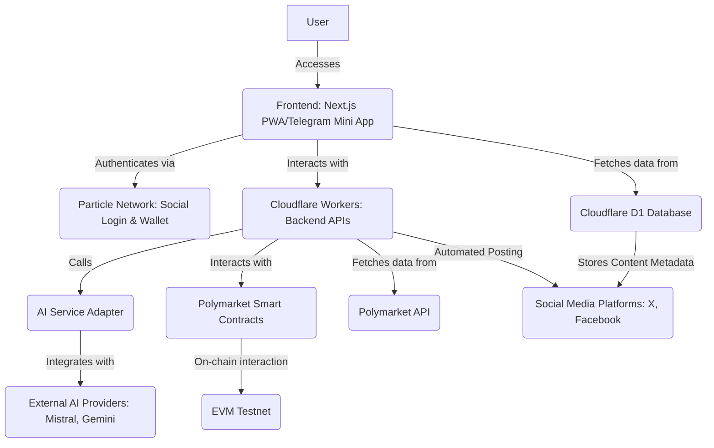
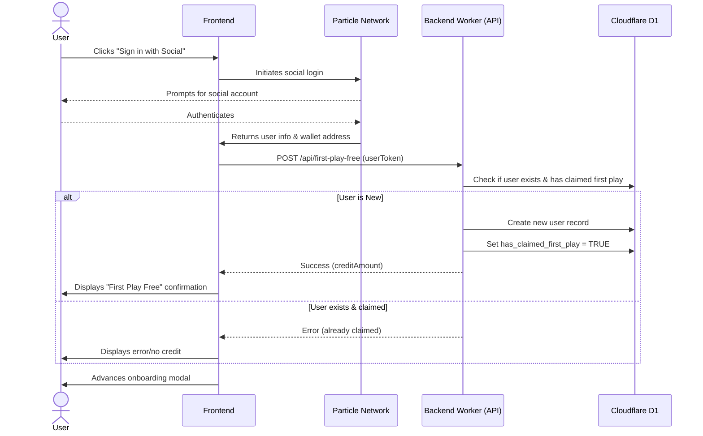
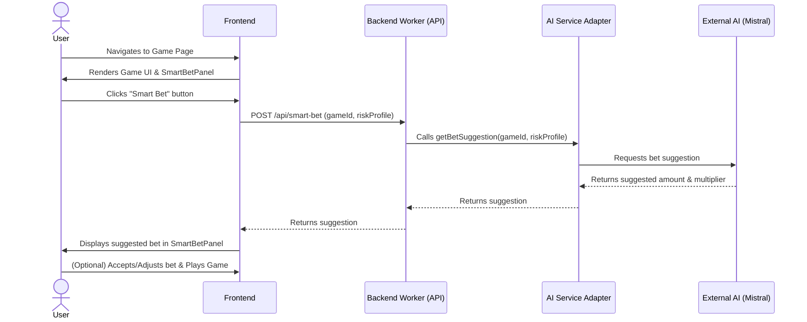
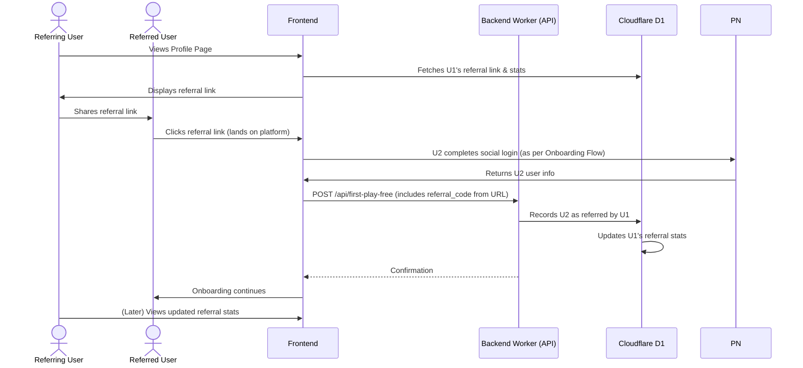
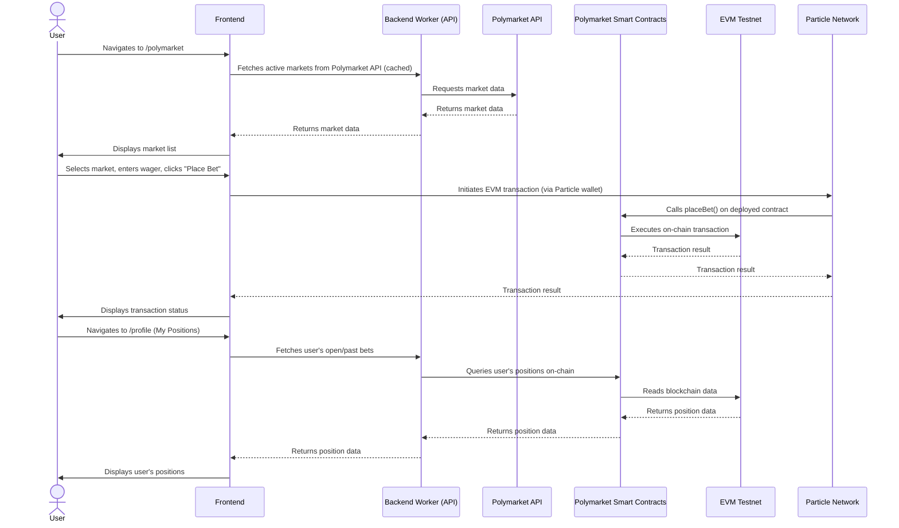
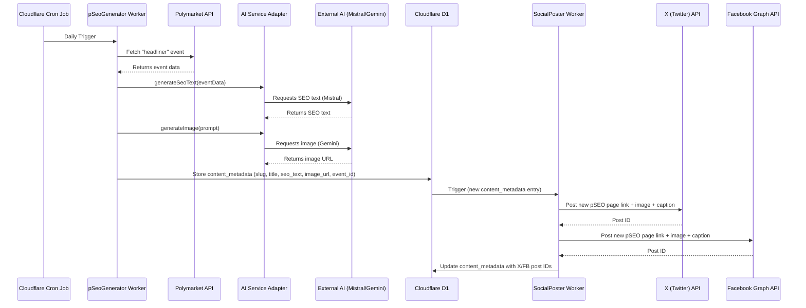

# QuantumNexus-FlashExperienceArchitecture-v1.0.md

### **1. Introduction**

This document outlines the technical design for the 'Flash Experience & Onboarding Engine' epic, which encompasses the foundational infrastructure, immersive UI, omnichain and social onboarding, Gamba gaming suite integration, Polymarket integration, and viral growth mechanisms for the Quantum Nexus platform. The goal is to deliver a visually stunning, intuitive, and highly performant decentralized application that drives rapid user acquisition and engagement.

### **2. Goals**

The primary goals for this epic, as derived from the Product Requirements Document (PRD), are:

*   **Rapid User Acquisition:** Achieve 10,000 Monthly Active Users (MAUs) within 6 months.
*   **Viral Coefficient:** Attain a K-factor of 0.4 or higher.
*   **Self-Funding Operation:** Reach a state where automated protocol revenue covers all non-labor operational costs within 12 months.
*   **Global Reach:** Launch with 10-language UI support.
*   **Deliver "Wow" Factor:** Establish a new standard for dApp user experience.
*   **"Time to Wow"**: Under 3 minutes from landing page to first on-chain interaction.

### **3. High-Level Architecture**

The Quantum Nexus platform will leverage a serverless-first architecture built on the Cloudflare ecosystem, integrating with external services like Particle Network, various AI providers, and Polymarket.

**Component Roles:**

*   **Frontend (Next.js PWA/Telegram Mini App):** The primary user interface, responsible for rendering the "Hyperspace Gateway" UI, handling user interactions, and communicating with backend APIs and external services.
*   **Particle Network:** Provides seamless social login and manages self-custodial wallet creation and EVM interactions for users.
*   **Cloudflare Workers (Backend APIs):** Serverless functions handling business logic, API integrations, and data processing. This includes APIs for "First Play Free," "Smart Bet," pSEO generation, and social posting.
*   **Cloudflare D1 Database:** A serverless SQL database used for storing application-specific data such as user preferences, referral data, and content metadata.
*   **AI Service Adapter:** An abstraction layer within Cloudflare Workers that allows for flexible integration with different external AI providers.
*   **External AI Providers (Mistral, Gemini):** Third-party AI services used for generating text (e.g., SEO content) and images.
*   **Polymarket Smart Contracts:** Deployed on an EVM testnet, these contracts enable on-chain betting interactions with the Polymarket protocol.
*   **Polymarket API:** Provides data feeds for active prediction markets.
*   **Social Media Platforms (X, Facebook):** Targets for automated posting of pSEO content.
*   **EVM Testnet:** The blockchain environment where Polymarket smart contracts are deployed and transactions occur.

### **4. Detailed Component Design**

#### **4.1. Frontend (Next.js/React)**

*   **Technology Stack:** Next.js, React, Zustand (for state management), Shadcn UI components.
*   **Key Components:**
    *   [`src/components/onboarding/OnboardingModal.tsx`](src/components/onboarding/OnboardingModal.tsx): Manages the initial user onboarding flow, including social login and "First Play Free" claim.
    *   [`src/components/game/GameCard.tsx`](src/components/game/GameCard.tsx) (to be replaced by "Insight Shard"): Displays individual game entries with immersive animations.
    *   `SmartBetPanel.tsx` (new): Provides the "Smart Bet" AI suggestion feature on game pages.
    *   `PolymarketMarketList.tsx` (new): Displays active Polymarket prediction markets.
    *   `UserPositionsTab.tsx` (new): Shows user's open and historical Polymarket bets.
*   **UI/UX:** Implementation of "Cosmic Bloom" palette, "Hyperspace Jump" transitions, and "Insight Shard" components to achieve the "Flash" experience.
*   **PWA & Telegram Mini App:** Configuration in `next.config.mjs` and a basic wrapper for Telegram Mini App integration.
*   **State Management:** `useUserStore` (Zustand) will manage global user state, including authentication status, wallet address, and `hasClaimedFirstPlay` flag.

#### **4.2. Backend (Cloudflare Workers)**

*   **Technology Stack:** Cloudflare Workers, Hono (for API routes).
*   **Key API Routes/Workers:**
    *   `POST /api/first-play-free`:
        *   **Input:** User token (from Particle Network).
        *   **Logic:** Verifies token, checks D1 for existing claim, creates user record if new, assigns micro-value credit, updates `hasClaimedFirstPlay` in D1.
        *   **Output:** Success/failure, credit amount.
    *   `POST /api/smart-bet`:
        *   **Input:** `gameId`, `riskProfile`.
        *   **Logic:** Calls `AI Service Adapter` to get a bet suggestion from Mistral AI.
        *   **Output:** Suggested wager amount and multiplier.
    *   `workers/pSeoGenerator` (Cron Triggered):
        *   **Logic:** Fetches headliner event from Polymarket, calls `AI Service Adapter` (Mistral for text, Gemini for image), stores generated content in `content_metadata` D1 table.
    *   `workers/socialPoster` (D1 Triggered):
        *   **Logic:** Triggered by new `content_metadata` entries, posts links to new pSEO pages with AI-generated image and caption to X and Facebook. Saves social media post IDs back to D1.

#### **4.3. Database (Cloudflare D1)**

*   **Technology Stack:** Cloudflare D1 (SQLite compatible).
*   **Key Tables & Schemas:**
    *   `users`: Stores user information, including `particle_id`, `wallet_address`, `has_claimed_first_play`, `referral_code`, `referred_by`.
    *   `leads`: Stores data for pSEO landing page lead capture.
    *   `user_preferences`: Stores user-specific settings.
    *   `content_metadata`: Stores metadata for AI-generated pSEO content, including `slug`, `title`, `seo_text`, `image_url`, `polymarket_event_id`, `x_post_id`, `facebook_post_id`.
    *   `referrals`: Stores referral relationships and performance metrics.

#### **4.4. Particle Network Integration**

*   **Role:** Primary authentication and wallet management solution.
*   **Functionality:**
    *   Social login (Google, etc.).
    *   Automatic creation of self-custodial wallets.
    *   EVM wallet integration for Polymarket betting.
*   **Frontend Integration:** `useParticleConnect` hook and `ParticleProviderWrapper`.
*   **Backend Integration:** Verification of user tokens from Particle Network.

#### **4.5. AI Service Adapter**

*   **Location:** `src/services/aiAdapter.ts` (or similar).
*   **Purpose:** Abstract interaction with various LLM providers.
*   **Methods:**
    *   `getBetSuggestion(gameId, riskProfile)`: Calls Mistral for "Smart Bet" suggestions.
    *   `generateSeoText(eventData)`: Calls Mistral for pSEO text generation.
    *   `generateImage(prompt)`: Calls Gemini for AI image generation.
*   **Configuration:** Environment variables to switch between AI providers.

#### **4.6. External APIs**

*   **Polymarket API:** Used by Cloudflare Workers and potentially frontend for fetching real-time market data.
*   **Mistral AI API:** For text generation (Smart Bets, pSEO content).
*   **Gemini API:** For image generation (pSEO content).
*   **X (Twitter) API:** For automated social posting.
*   **Facebook Graph API:** For automated social posting.

### **5. Interfaces and Data Flows**

#### **5.1. User Onboarding Flow**

#### **5.2. Gamba Game Play & Smart Bet Flow**

#### **5.3. Gamified Referral System Flow**

#### **5.4. Polymarket Integration Flow**

#### **5.5. AI Content & Social Posting Flow**

### **6. Technical Considerations/Assumptions**

*   **Monorepo Structure:** Development will continue within the `bankkroll-gamba-v2-next.js.git` monorepo, with dedicated `workers/` and `infra/` directories.
*   **Serverless-First:** Emphasis on Cloudflare Pages, Workers, and D1 for scalability, cost-effectiveness, and reduced operational overhead.
*   **Testing:**
    *   **Unit Tests:** Mandatory for all new business logic (AI adapter, referral logic, fee structures).
    *   **E2E Tests:** Cover full user journeys for "First Play Free" onboarding, Gamba game lifecycle, and Polymarket betting lifecycle.
    *   **Visual Regression Tests:** For key UI components to prevent design degradation.
*   **Scalability:** The pSEO engine and D1 database schema are designed to scale to thousands of pages without significant manual oversight or cost increase.
*   **Caching:** Cloudflare KV will be implemented for Polymarket data to ensure UI performance and resilience against external API downtime.
*   **Modularity:** The core architecture is designed to support future integrations (e.g., THORChain) without major refactoring.
*   **Security:** All API routes and smart contract interactions will adhere to best practices for security, including input validation, authentication, and authorization.
*   **Cost Optimization:** Infrastructure will be designed to operate within free or near-zero-cost tiers for the initial 6 months.

### **7. Future Enhancements (Out of Scope for this Document)**

*   THORChain integration for cross-chain swaps.
*   Implementation of a high-contrast light theme.
*   Advanced gamification features for the referral system.
*   Further AI model integrations and optimizations.