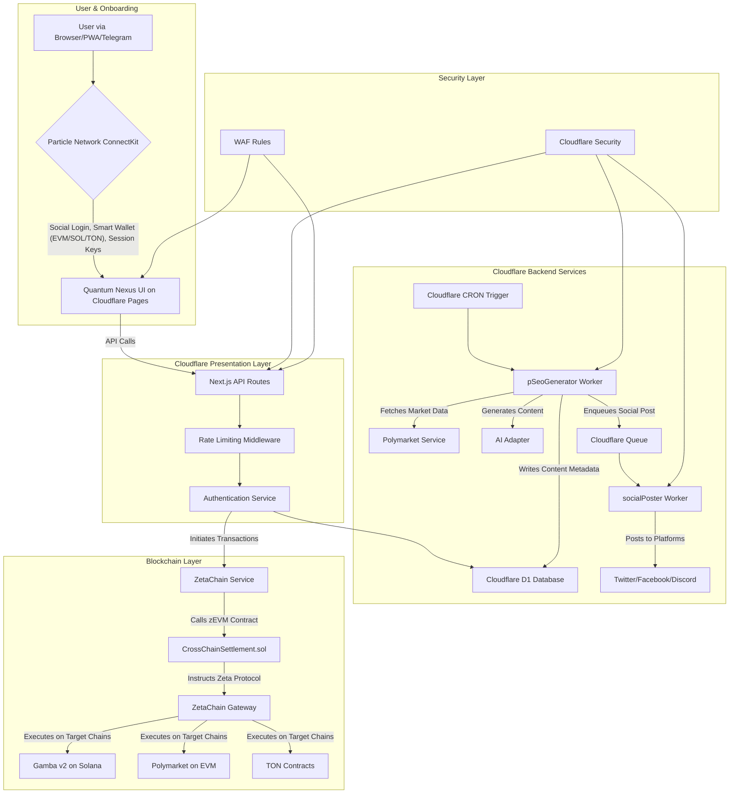

# Quantum Nexus Architecture Blueprint v2.0 (Definitive)

**Version:** 2.0 | **Date:** 2025-07-12

**Version History**

| Version | Date       | Changes                  |
|---------|------------|--------------------------|
| 2.0     | 2025-07-12 | Initial definitive draft |
| 2.1     | 2025-08-03 | Enhanced architecture diagram with Cloudflare details |

### 1. Architectural Principle: The Universal App
The system is a **Universal App** built on ZetaChain. Our core logic is deployed once to the ZetaChain zEVM and orchestrates interactions with all connected chains (**EVM, Solana, and TON**). The frontend, powered by Particle Network, interacts with ZetaChain as its primary backend.

### 2. Enhanced System Overview Diagram

### Implementation Status

| Component              | Status        | Notes |
|------------------------|---------------|-------|
| Universal Contract     | ✅ Implemented| Core cross-chain logic |
| pSEO Generator         | ⚠️ Partial    | Content generation done, social queue pending |
| Session Keys           | ❌ Pending    | Planned for Q3 2025 |
| Smart Bet Suggestions  | ❌ Pending    | Requires AI model training |
| Rate Limiting          | ✅ Implemented| Applied to all API endpoints |
| D1 Database            | ✅ Implemented| Cloudflare-native database |

### 3. Backend Services & AI Engine Architecture
- **API Routes (`src/pages/api/`)**: Handle synchronous, user-facing requests with built-in security layers.
- **Cloudflare Workers & Queues (`src/workers/`)**:
  - **`pSeoGenerator-worker.ts`**: Runs on CRON trigger. Generates content and enqueues social posts.
  - **`socialPoster-worker.ts`**: Triggered by queue messages. Posts to social media platforms.
- **AI Service Adapter (`src/services/aiAdapter.ts`)**: Unified interface for LLMs (pSEO, Smart Bets).

### 4. Database Schema
See [Database Schema Documentation](/docs/architecture/database-schema.md) for full details. Primary key for users is `particle_user_id`.
