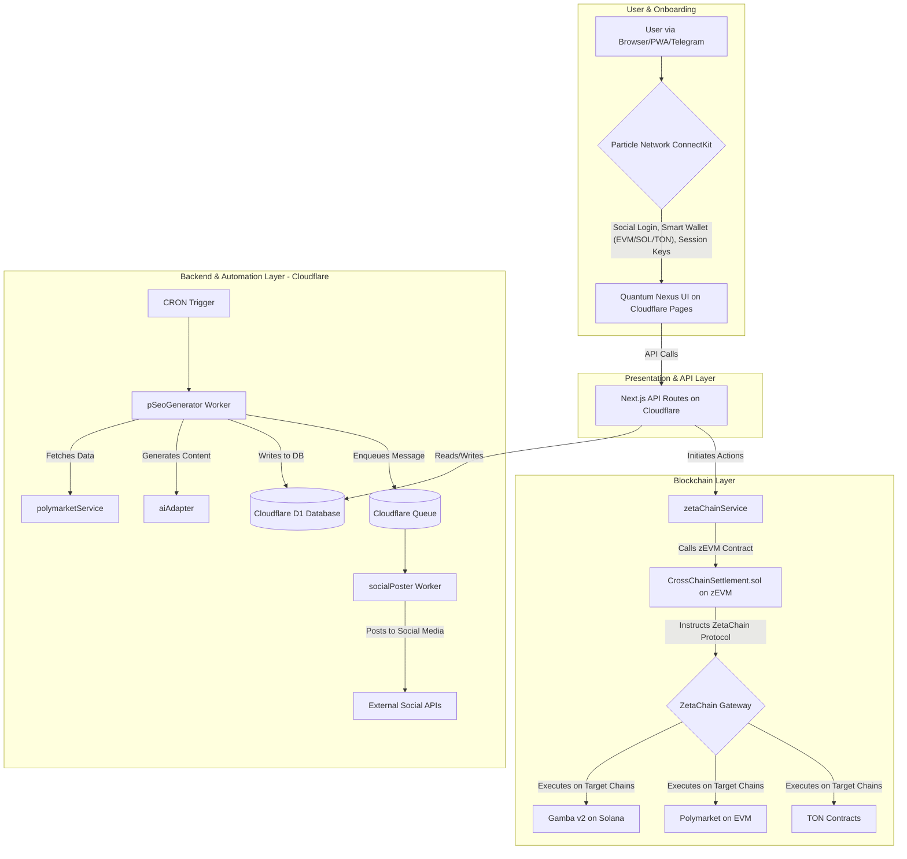

# Quantum Nexus Architecture Blueprint v2.0 (Definitive)

**Version:** 2.0 | **Date:** 2025-07-12

### 1. Architectural Principle: The Universal App
The system is a **Universal App** built on ZetaChain. Our core logic is deployed once to the ZetaChain zEVM and orchestrates interactions with all connected chains (**EVM, Solana, and TON**). The frontend, powered by Particle Network, interacts with ZetaChain as its primary backend.

### 2. System Overview Diagram


### 3. Backend Services & AI Engine Architecture
- **API Routes (`src/pages/api/`)**: Handle synchronous, user-facing requests.
- **Cloudflare Workers & Queues (`src/workers/`)**:
  - **`pSeoGenerator-worker.ts`**: Runs on a CRON trigger. It generates content and **enqueues a message to Cloudflare Queues**. This decouples content creation from social media posting.
  - **`socialPoster-worker.ts`**: Triggered by messages on the Cloudflare Queue. It consumes the message and posts to social media.
- **AI Service Adapter (`src/services/aiAdapter.ts`)**: A modular service that acts as a unified interface for various LLMs. Its responsibilities include generating pSEO content, social media posts, and providing **"Smart Bet" suggestions**.

### 4. Database Schema (`infra/d1/schema_v2.sql`)
The definitive database schema. The primary key for users **MUST** be `particle_user_id`. It also includes tables for `polymarket_markets_cache`, `zetachain_cctx_log`, and a new `credit_config` table to manage the "First Play Free" rules.
```
