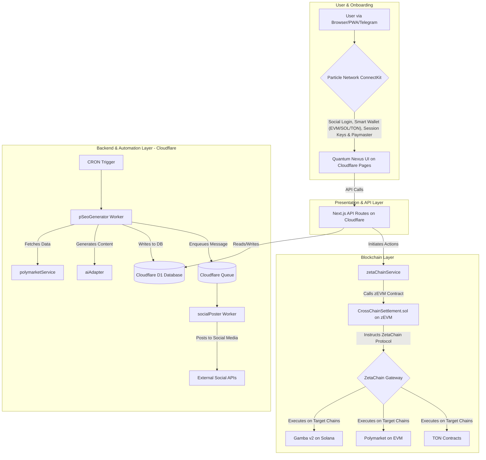

# Quantum Nexus Architecture Blueprint v2.0 (Definitive)

**Document Status:** **ACTIVE & DEFINITIVE** | **Version:** 2.0 | **Date:** 2025-07-08
**Governing Document:** This architecture is the technical implementation of the Phoenix Blueprint PRD v2.0.

### 1. Architectural Principle: The Universal App
The system is a **Universal App** built on ZetaChain. Our core logic is deployed once to the ZetaChain zEVM and orchestrates interactions with all connected chains (**EVM, Solana, and TON**), abstracting their complexity. The frontend, powered by Particle Network's WaaS, interacts with ZetaChain as its primary backend, providing a unified experience for users regardless of where their assets reside.

### 2. System Overview Diagram



### 3. Smart Contract Architecture (zEVM & Target Chains)

The architecture is designed for maximum security and simplicity by separating generic logic from specific application logic.

*   **`CrossChainSettlement.sol` (The Universal Contract on zEVM)**
    *   **Purpose:** To be the single, chain-agnostic entry point for all cross-chain operations. It is a generic dispatcher and contains no application-specific logic (e.g., no knowledge of Polymarket or Gamba).
    *   **Key Function:** `function dispatchCrossChainCall(uint256 destinationChainId, bytes memory destinationAddress, bytes memory message) external payable;`
    *   **Workflow:** The backend service (`zetaChainService`) calls this function. The contract's sole responsibility is to validate the call and use the ZetaChain protocol to forward the `message` to the `destinationAddress` on the `destinationChainId`.

*   **`PolymarketAdapter.sol` (The Target Contract on EVM)**
    *   **Purpose:** A specific "endpoint" contract deployed on the same chain as Polymarket (e.g., Polygon). It is the target of ZetaChain cross-chain calls destined for Polymarket.
    *   **Key Function:** `function onZetaMessage(ZetaInterfaces.ZetaMessage calldata zetaMessage) external override;`
    *   **Workflow:** When a cross-chain message arrives from ZetaChain, this function is executed. It decodes the `zetaMessage.message` payload to understand the user's intent (e.g., "place bet," "create limit order") and then makes the appropriate calls to the Polymarket protocol contracts on its own chain.

### 4. Backend Services & AI Engine Architecture

*   **API Routes (`src/pages/api/`)**: Handle synchronous, user-facing requests (e.g., CRUD for tournaments, fetching user preferences).
*   **Cloudflare Workers & Queues (`src/workers/`)**:
    *   **`pSeoGenerator-worker.ts`**: Runs on a CRON trigger. It fetches trending markets, uses the `aiAdapter` to generate localized content, writes this content to D1, and **enqueues a message to Cloudflare Queues**. This decouples content creation from social media posting, increasing resilience.
    *   **`socialPoster-worker.ts`**: Triggered by messages on the Cloudflare Queue. It consumes the message containing content metadata and posts to the relevant social media platforms via their APIs.
*   **AI Service Adapter (`src/services/aiAdapter.ts`)**:
    *   A modular service that acts as a unified interface for various LLMs (e.g., Mistral, Gemini).
    *   **Responsibilities:**
        1.  Generating pSEO content (titles, articles).
        2.  Generating social media post text.
        3.  Providing "Smart Bet" suggestions (for both free and premium tiers).
        4.  (Future) Analyzing gameplay data for dynamic game balancing.

### 5. Database Schema (`infra/d1/schema_v2.sql`)
The definitive database schema is outlined in `infra/d1/schema_v2.sql`. Key architectural decisions reflected in this schema are:
*   **Primary Key Change:** The `user_preferences` table **MUST** use `particle_user_id TEXT` as its primary key. This is a universal identifier from Particle Network and is essential for supporting a user's multiple wallets across different chains.
*   **New Log & Cache Tables:**
    *   `polymarket_markets_cache`: Caches data from the Polymarket API to improve performance and reduce external calls.
    *   `zetachain_cctx_log`: Logs all cross-chain transaction hashes (CCTX) initiated by the platform for auditing, status tracking, and debugging.

### 6. Internationalization (i18n) Architecture
*   **Framework:** `next-i18next`.
*   **File Structure:** All static UI text strings **MUST** be stored in JSON files within `public/locales/{lang_code}/common.json`.
*   **Target Languages:** The initial launch **MUST** support the 10 official languages: `en`, `zh`, `es`, `pt`, `ru`, `tr`, `ko`, `ja`, `vi`, `id`.

### 7. Core User Experience Architecture
*   **Particle Network Session Keys:** This is a critical architectural component for achieving the project's vision of a seamless UX. The frontend **MUST** implement a flow to request a session key signature from the user upon login. This key will be used to sign subsequent, low-value transactions automatically, eliminating the "death by a thousand pop-ups" problem common in dApps and creating a true Web2-like session experience.
```
