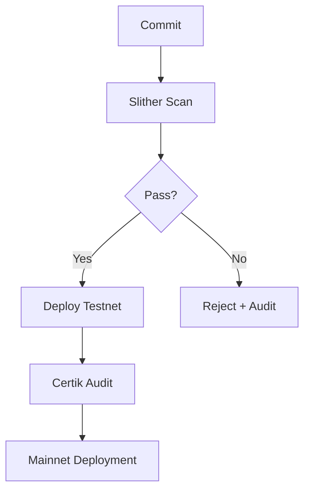

# Gaming Platform Coding Standards v1.0

## Cross-Chain Smart Contracts
1. **EVM Chains (Polygon, BSC)**:
   - Solidity 0.8.20 with `checked` math
   - OpenZeppelin Contracts 4.9.3
   - Chainlink VRF for randomness
2. **Solana**:
   - Anchor framework 0.29.0
   - Security audits via Sec3
3. **TON**:
   - Func language compliance
   - Jetton token standard integration

## Frontend Requirements
- TypeScript strict mode (`"strict": true`)
- React Query for API state management
- Isolated game logic in Web Workers
- Linting: ESLint + typescript-eslint

## Security Protocols

## Code Review Process
1. All PRs require:
   - 2 senior engineer approvals
   - Security lead sign-off for financial logic
   - 90% test coverage threshold
   - Gas optimization report for contracts