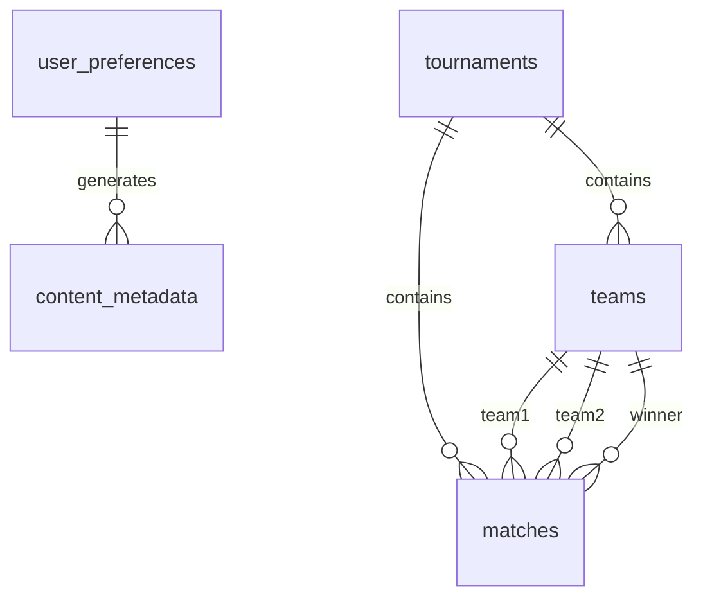

# Quantum Nexus Database Schema Documentation

## Overview
This document describes the database schema for Quantum Nexus v2.0, implemented in Cloudflare D1. The schema is optimized for our gaming and prediction market platform, with a focus on user preferences, market data caching, cross-chain transactions, and content management.

## Table Relationships

## Table Specifications

### user_preferences
Stores user-specific settings and preferences using Particle Network's universal ID system.

| Column | Type | Constraints | Description |
|--------|------|-------------|-------------|
| particle_user_id | TEXT | PRIMARY KEY | Universal user ID from Particle Network |
| username | TEXT |  | User's display name |
| riskTolerance | TEXT | CHECK: low/medium/high | User's risk preference for betting |
| preferredGames | TEXT |  | JSON array of preferred game IDs |
| notificationSettings | TEXT |  | JSON configuration for notifications |
| smartBet | BOOLEAN | DEFAULT TRUE | Whether to show smart bet suggestions |
| lastLogin | DATETIME | DEFAULT CURRENT_TIMESTAMP | Last login timestamp |
| createdAt | DATETIME | DEFAULT CURRENT_TIMESTAMP | Account creation timestamp |

### polymarket_markets_cache
Caches Polymarket data to reduce API calls and improve performance.

| Column | Type | Constraints | Description |
|--------|------|-------------|-------------|
| condition_id | TEXT | PRIMARY KEY | Polymarket condition identifier |
| question | TEXT | NOT NULL | Market question text |
| category | TEXT |  | Market category |
| volume_usd | REAL | DEFAULT 0 | Trading volume in USD |
| liquidity_usd | REAL | DEFAULT 0 | Market liquidity in USD |
| end_date_iso | TEXT |  | Market end date (ISO format) |
| is_active | BOOLEAN |  | Whether market is active |
| is_closed | BOOLEAN |  | Whether market is closed |
| last_updated | DATETIME | DEFAULT CURRENT_TIMESTAMP | Last cache update timestamp |

### zetachain_cctx_log
Logs cross-chain transactions for auditing and monitoring.

| Column | Type | Constraints | Description |
|--------|------|-------------|-------------|
| cctx_hash | TEXT | PRIMARY KEY | Cross-chain transaction hash |
| source_chain | TEXT | NOT NULL | Source blockchain identifier |
| destination_chain | TEXT | NOT NULL | Destination blockchain identifier |
| asset | TEXT |  | Transferred asset |
| amount | TEXT |  | Amount transferred (string to handle large numbers) |
| status | TEXT | DEFAULT 'pending' | Transaction status |
| created_at | DATETIME | DEFAULT CURRENT_TIMESTAMP | Creation timestamp |
| updated_at | DATETIME | DEFAULT CURRENT_TIMESTAMP | Last update timestamp |

### content_metadata
Stores metadata for AI-generated pSEO content.

| Column | Type | Constraints | Description |
|--------|------|-------------|-------------|
| id | TEXT | PRIMARY KEY DEFAULT hex(randomblob(16)) | Unique content ID |
| urlPath | TEXT | UNIQUE NOT NULL | URL path for the content |
| title | TEXT | NOT NULL | Content title |
| metaDescription | TEXT |  | SEO meta description |
| keywords | TEXT |  | Comma-separated keywords |
| generatedHtml | TEXT |  | Generated HTML content |
| imageUrl | TEXT |  | URL to image in Cloudflare R2 |
| generationDate | DATETIME | DEFAULT CURRENT_TIMESTAMP | Content generation timestamp |
| socialPostQueueId | TEXT |  | Cloudflare Queue ID for social posting |

### Tournaments
Manages tournament information and structure.

| Column | Type | Constraints | Description |
|--------|------|-------------|-------------|
| id | TEXT | PRIMARY KEY DEFAULT hex(randomblob(16)) | Unique tournament ID |
| name | TEXT | NOT NULL | Tournament name |
| format | TEXT | CHECK: single/double-elimination, round-robin | Tournament format |
| status | TEXT | CHECK: upcoming/ongoing/completed | Current status |
| createdAt | DATETIME | DEFAULT CURRENT_TIMESTAMP | Creation timestamp |

### Teams
Represents teams participating in tournaments.

| Column | Type | Constraints | Description |
|--------|------|-------------|-------------|
| id | TEXT | PRIMARY KEY DEFAULT hex(randomblob(16)) | Unique team ID |
| tournament_id | TEXT | FOREIGN KEY REFERENCES tournaments(id) | Associated tournament |
| name | TEXT | NOT NULL | Team name |
| players | TEXT |  | JSON array of player user IDs |

### Matches
Tracks individual matches within tournaments.

| Column | Type | Constraints | Description |
|--------|------|-------------|-------------|
| id | TEXT | PRIMARY KEY DEFAULT hex(randomblob(16)) | Unique match ID |
| tournament_id | TEXT | FOREIGN KEY REFERENCES tournaments(id) | Associated tournament |
| round | INTEGER | NOT NULL | Tournament round number |
| match_number | INTEGER | NOT NULL | Match sequence number |
| team1_id | TEXT | FOREIGN KEY REFERENCES teams(id) | First team |
| team2_id | TEXT | FOREIGN KEY REFERENCES teams(id) | Second team |
| score1 | INTEGER |  | Team 1 score |
| score2 | INTEGER |  | Team 2 score |
| winner_id | TEXT | FOREIGN KEY REFERENCES teams(id) | Winning team |
| next_match_id | TEXT |  | Next match in bracket |

## Index Recommendations
1. `user_preferences(lastLogin)` - For active user reports
2. `polymarket_markets_cache(last_updated)` - For cache refresh efficiency
3. `zetachain_cctx_log(status)` - For transaction monitoring
4. `content_metadata(generationDate)` - For content freshness analysis
5. `matches(tournament_id, round)` - For tournament progression tracking