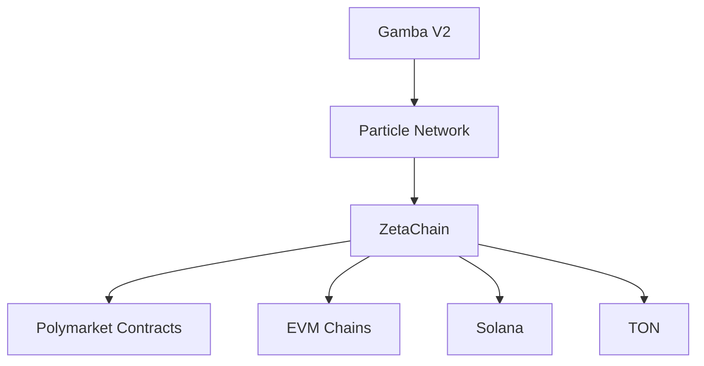

# External Dependencies

## Core Integrations

### Polymarket
- **Integration Type**: Prediction market adapter
- **Interface**: Custom ABI for polymarket contracts
- **Responsibilities**:
  - Market resolution monitoring
  - Liquidity pool interactions
  - Cross-chain settlement via ZetaChain

### ZetaChain
- **Role**: Omnichain smart contract platform
- **Key Functions**:
  - Cross-chain message passing
  - Gas currency abstraction
  - Unified API for EVM/Solana/TON

## Future Considerations
- **Thorchain**: Documented but not currently implemented. Would provide:
  - Cross-chain liquidity pools
  - Native asset swaps
  - Requires separate security audit
