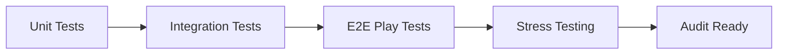

# Quality Assurance Protocol v1.0

## Automated Testing


## Security Audits
1. **Smart Contracts**:
   - Monthly Certik audits
   - Immutable post-audit contracts
   - Bug bounty program ($100k max)

2. **Frontend**:
   - OWASP ZAP scans weekly
   - Dependency vulnerability monitoring

## Cross-Chain Validation
- Parallel testnet deployments
- Bridge contract simulation testing
- Chainlink oracle consistency checks

## Compliance
- Monthly financial authority reviews
- KYC/AML provider integration checks
- Jurisdictional law updates monitoring

## Incident Management
```mermaid
sequenceDiagram
    Participant D as Detection
    Participant R as Response
    Participant P as Post-Mortem
    D->>R: Alert via PagerDuty
    R->>P: Root cause analysis
    P->>R: Protocol updates