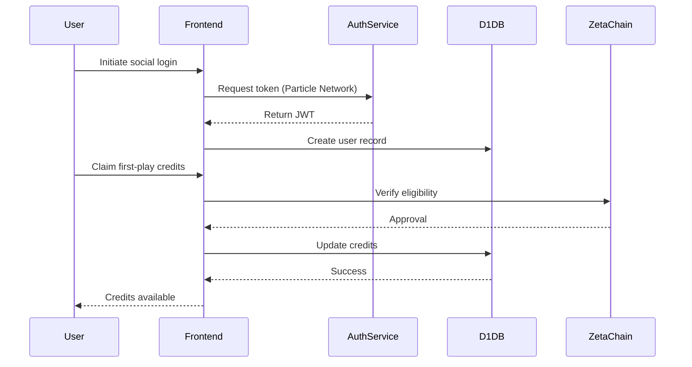
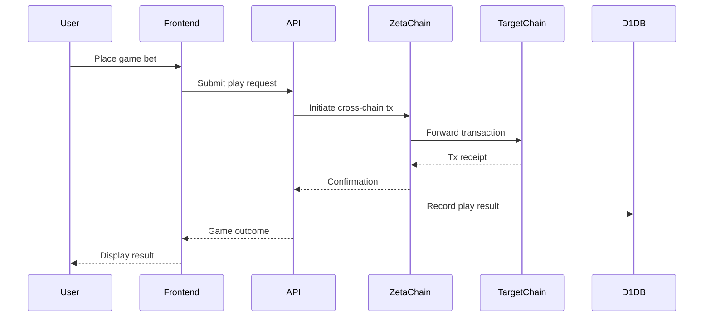
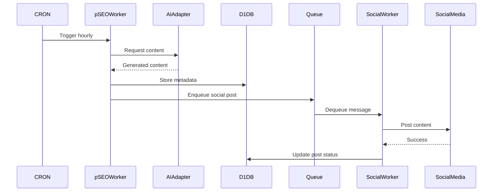

# Critical Workflow Sequence Diagrams

## 1. User Onboarding & Credit Claiming

## 2. Cross-Chain Game Play

## 3. AI-Generated Content Publishing

> **Note:** These diagrams use the Mermaid syntax without double quotes in square brackets to avoid parsing errors.