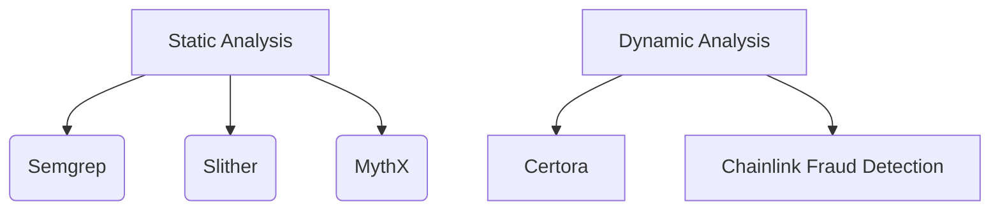

# Universal Contract Standard

## 1. Cross-Chain Interface Specifications
```solidity
// EVM/Solana/TON Interface Compliance
interface ICrossChainOperations {
    function executeCrossChainCall(
        uint256 targetChainId,
        bytes calldata payload
    ) external payable returns (bytes32 operationId);
    
    event CrossChainOperationCompleted(
        bytes32 indexed operationId,
        uint256 sourceChainId,
        uint256 targetChainId
    );
}
```

### 1.1 ZetaChain Integration Patterns
- **Omnichain Contracts**: Must implement `IZetaReceiver` interface
- **Gas Management**: Use ZetaChain's gas token abstraction layer
- **Error Handling**: Implement circuit breaker pattern for failed transactions

## 2. Versioning Strategy
- **Semantic Versioning** (Major.Minor.Patch)
- **Immutable Contracts**: Once deployed, only security patches allowed
- **Version Mapping**:
  | Contract Type       | Version | ZetaChain Compatible |
  |---------------------|---------|----------------------|
  | Payment Gateway     | 1.2.0   | ≥2.3.1               |
  | Tournament Manager  | 0.8.4   | ≥2.1.0               |

## 3. Audit Requirements


- **Pre-Deployment**: Full formal verification for ≥$100k TVL contracts
- **Post-Deployment**: Quarterly third-party audits

## 4. Repository Hygiene Protocols
```
contracts/
├── evm/
│   ├── dependencies/ # Chainlink contracts
│   └── interfaces/
├── solana/
│   └── programs/ # Anchor implementations
└── ton/
    └── func/ # FunC contracts
```

- **CI/CD Requirements**:
  - `forge test` with ≥95% coverage
  - Slither vulnerability scan
  - Storage layout check for upgrades

## 5. Security & Dependency Standards
### 5.1 Vulnerability Policy
- **Critical** (CVSS ≥9.0): 24h response SLA
- **High** (CVSS 7.0-8.9): 72h mitigation
- **Dependencies**: Weekly `npm audit` + `yarn-deduplicate`

### 5.2 Monitoring & Incident Response
```javascript
// Cloudflare Worker Security Middleware
addEventListener('fetch', event => {
    event.respondWith(handleRequest(event.request)
        .catch(err => {
            sendSecurityAlert(err);
            return new Response('Blocked suspicious activity', {status: 403});
        })
    );
});
```

### 5.3 Compliance Requirements
- PCI-DSS L1 for payment processors
- GDPR Article 32 for user data handling