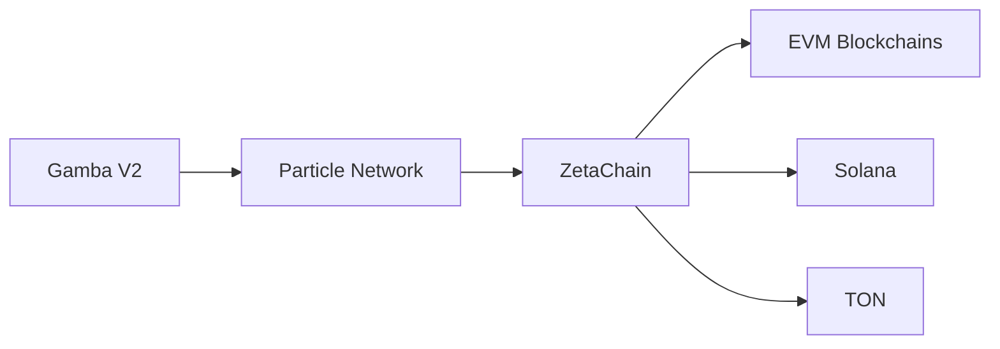
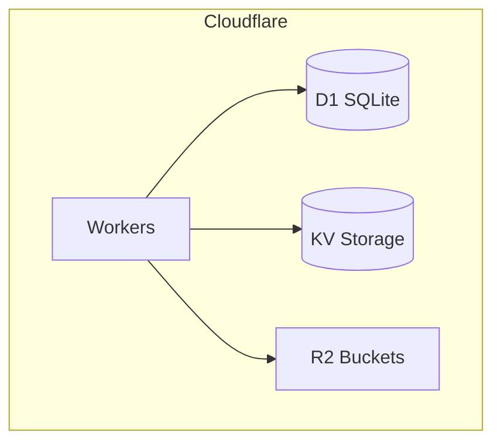

# ZetaChain Integration Architecture

## 1. System Context Diagram

## 2. Component Interactions
| Component          | Responsibility                          | Integration Points               |
|--------------------|-----------------------------------------|----------------------------------|
| Gamba V2           | Game UI/UX                              | Particle Auth & Wallet Services  |
| Particle Network   | Social Auth & Wallet Abstraction        | ZetaChain Connector              |
| ZetaChain          | Cross-chain Messaging & Asset Transfers | EVM/Solana/TON Bridges           |
| Cloudflare Workers | Serverless API Endpoints                | D1, KV Storage                   |

## 3. Data Flow
1. User auth via Particle Network (social login)
2. Particle generates AA wallet → ZetaChain connector
3. ZetaChain routes transactions to target chains:
   - EVM: Ethereum/Polygon
   - Solana: Mainnet
   - TON: Mainnet
4. Cloudflare Workers handle:
   - API routing (`/api/v1/*`)
   - First-play-free credits
   - Tournament management

## 4. Cloudflare Infrastructure

### 4.1 Services Usage
| Service       | Purpose                                                                 | Example Use Case                     |
|---------------|-------------------------------------------------------------------------|--------------------------------------|
| Workers       | Serverless functions for API routes                                     | `src/pages/api/v1/tournaments/*`     |
| D1            | SQL database for relational data                                        | User preferences, tournament records |
| KV Storage    | Key-value store for session data, caching                               | Caching exchange rates               |
| R2            | Object storage for static assets                                        | Game assets, user uploads            |

## 5. Security & Dependency Standards
- **Vulnerability Policy**:
  - Weekly Semgrep scans (`uvx semgrep-mcp`)
  - Dependency auditing via `npm audit`
  - ZetaChain tx validation
- **Critical Controls**:
  - Particle Network JWT verification
  - ZetaChain message signing
  - Cloudflare WAF rules
- **Monitoring**:
  - Cloudflare Analytics
  - ZetaChain explorer integration

## 6. Configuration Requirements

For the ZetaChain integration to function correctly, the following environment variables must be configured with actual deployed contract values:

- `ZETACHAIN_CONTRACT_ADDRESS`: The deployed address of the ZetaChain omnichain smart contract.
- `ZETACHAIN_CONTRACT_ABI`: The ABI (Application Binary Interface) of the deployed ZetaChain omnichain smart contract. This should be a JSON string.

These variables are crucial for the `ZetaChainSettlement` worker to interact with the correct contract on the ZetaChain network. They should be securely managed, ideally through Cloudflare Workers Secrets or a similar secure vault solution in production environments.

## 7. Credential Management

Polymarket API credentials (`POLYMARKET_API_KEY` and `POLYMARKET_API_SECRET`) are sensitive and must be securely stored. It is recommended to use Cloudflare Workers Secrets for managing these credentials in the production environment. This ensures that API keys are not hardcoded and are securely injected into the worker's runtime.