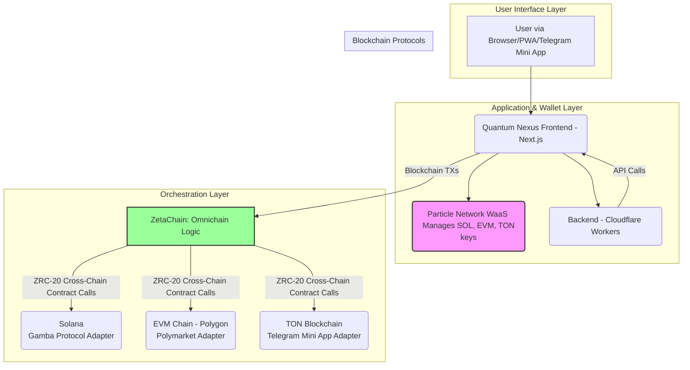

# Quantum Nexus: Cross-Chain Architecture

## 1. Introduction

This document details the cross-chain architecture for the Quantum Nexus platform, leveraging ZetaChain as the omnichain orchestration layer. The design integrates Solana (for Gamba gaming), EVM chains (for Polymarket prediction markets), and TON (for Telegram-based interactions) into a unified user experience.

The core principle is to abstract the complexity of multi-chain interactions from the user. Users will interact with a single interface, and ZetaChain will handle the routing of messages and value to the appropriate destination chain.

## 2. Cross-Chain Architecture Diagram

The following diagram illustrates the high-level architecture, showing the flow of information from the user, through the application and ZetaChain, to the target blockchains.



**Component Roles:**

*   **User Interface Layer:** The user-facing application, accessible via a web browser, PWA, or a Telegram Mini App.
*   **Application & Wallet Layer:**
    *   **Quantum Nexus Frontend:** The Next.js application that renders the UI and handles user interactions.
    *   **Particle Network WaaS:** Provides social login and manages the user's self-custodial wallets for all integrated chains (Solana, EVM, TON). It signs transactions initiated by the user.
    *   **Backend (Cloudflare Workers):** Handles off-chain logic, API integrations (e.g., AI services, Polymarket data feeds), and database operations.
*   **Orchestration Layer (ZetaChain):**
    *   **Omnichain Logic:** A set of smart contracts deployed on ZetaChain that act as the central hub for all cross-chain operations. The frontend sends transactions to these contracts.
    *   **ZRC-20 Cross-Chain Contract Calls:** ZetaChain's mechanism for message and value transfer. The Omnichain Logic contracts use this to call adapter contracts on the connected chains.
*   **Blockchain Protocols:**
    *   **Solana (Gamba):** An adapter contract on Solana that receives instructions from ZetaChain and interacts with the Gamba protocol to place bets or perform other gaming actions.
    *   **EVM Chain (Polymarket):** An adapter contract on an EVM chain (e.g., Polygon) that receives instructions from ZetaChain and interacts with Polymarket's smart contracts.
    *   **TON Blockchain (Telegram):** An adapter contract on the TON blockchain that facilitates interactions originating from the Telegram Mini App, such as distributing rewards or managing user-specific data on-chain.

---
## 3. Message Passing Protocol

All cross-chain messages will be routed through ZetaChain. A standardized message format is critical for ensuring interoperability and maintainability. We will use a JSON-based payload for all ZRC-20 contract calls.

The frontend will construct a message object, which will be passed as an argument to the primary Omnichain Logic contract on ZetaChain.

**Standard Message Format:**

```json
{
  "destination_chain": "solana | polygon | ton",
  "destination_address": "0x... | So1... | UQ...",
  "interaction_type": "gamba_bet | polymarket_trade | ton_reward",
  "payload": {
    // Payload structure varies based on interaction_type
  },
  "metadata": {
    "user_wallet": "0x... | So1... | UQ...",
    "timestamp": "YYYY-MM-DDTHH:mm:ss.sssZ",
    "nonce": 12345
  }
}
```

**Field Definitions:**

*   `destination_chain`: The target blockchain for the interaction.
*   `destination_address`: The address of the adapter contract on the destination chain.
*   `interaction_type`: A string enum that defines the intended action. This allows the destination adapter contract to correctly interpret the payload.
*   `payload`: A JSON object containing the specific data needed for the interaction.
*   `metadata`: Contains supplementary information for tracking and security.
    *   `user_wallet`: The original user's wallet address.
    *   `timestamp`: ISO 8601 timestamp for the message creation.
    *   `nonce`: A unique number for replay protection.

---
## 4. Gas Token Requirements

To execute transactions on the connected blockchains, gas fees must be paid in their respective native tokens. ZetaChain's architecture simplifies this for the user by abstracting away the need to hold multiple gas tokens.

**Gas Payment Mechanism:**

The user will only need to hold ZETA tokens. When a user initiates a transaction from the Quantum Nexus frontend, they will pay the gas fee in ZETA. The ZetaChain Omnichain Logic contract will then use this fee to cover the gas costs on the destination chain.

**Native Gas Tokens:**

| Blockchain | Native Token | Purpose |
| :--- | :--- | :--- |
| **ZetaChain** | ZETA | Primary token for paying gas on all cross-chain transactions initiated from Quantum Nexus. |
| **Solana** | SOL | Gas for executing transactions on the Gamba Protocol Adapter contract. |
| **EVM (Polygon)** | MATIC | Gas for executing transactions on the Polymarket Adapter contract. |
| **TON** | Toncoin | Gas for executing transactions on the Telegram Mini App Adapter contract. |

The platform may choose to subsidize gas fees for certain actions (e.g., "First Play Free") by programmatically funding the transaction from a protocol-owned wallet.

---
## 5. Security Considerations

Cross-chain operations introduce unique security challenges. The following considerations are paramount to ensuring the integrity and safety of the Quantum Nexus platform.

**Key Security Measures:**

*   **Contract Audits:**
    *   All custom-developed smart contracts, including the ZetaChain Omnichain Logic and all destination chain adapter contracts, will undergo rigorous independent security audits before deployment to mainnet.
    *   **Responsibility:** Development Team / Third-Party Auditors.

*   **Replay Protection:**
    *   The `nonce` field in the standard message format is essential for preventing replay attacks. The destination adapter contracts must maintain a record of processed nonces for each user wallet and reject any duplicates.
    *   **Responsibility:** Smart Contract Developers.

*   **Input Validation:**
    *   Adapter contracts on each destination chain must perform strict input validation on the `payload` data received from ZetaChain. This prevents malicious or malformed data from causing unintended behavior.
    *   **Responsibility:** Smart Contract Developers.

*   **Access Control:**
    *   The adapter contracts will be configured to only accept calls from the official Quantum Nexus Omnichain Logic contract on ZetaChain. This will be enforced using `require` statements that check the sender's address.
    *   **Responsibility:** Smart Contract Developers.

*   **Monitoring and Alerting:**
    *   An off-chain monitoring service will be implemented to track the health of the cross-chain system. It will watch for failed transactions, unusual volume spikes, or other anomalies and trigger alerts to the development team.
    *   **Responsibility:** Backend/DevOps Team.

*   **Upgradeability:**
    *   All smart contracts will be deployed using a proxy pattern (e.g., OpenZeppelin's UUPSUpgradeable). This allows for bug fixes and feature enhancements without requiring a full migration of user data.
    *   **Responsibility:** Smart Contract Developers.

*   **Data Authenticity:**
    *   While ZetaChain ensures the message is delivered, the adapter contracts are responsible for trusting the integrity of the payload. For highly sensitive operations, digital signatures within the payload could be considered for an additional layer of security, though this adds complexity.
    *   **Responsibility:** Architecture Team / Smart Contract Developers.