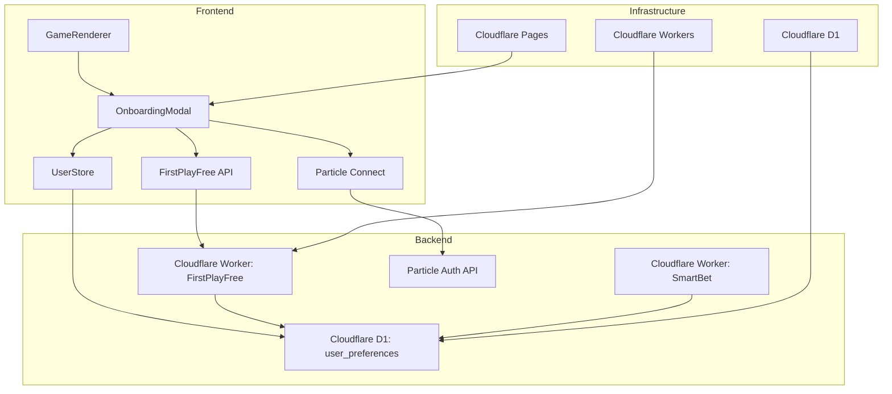
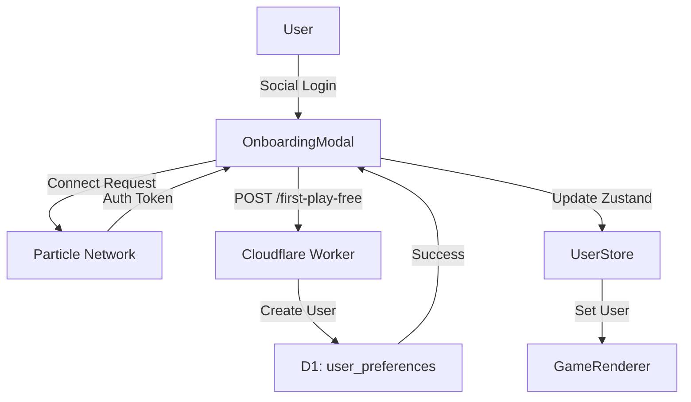
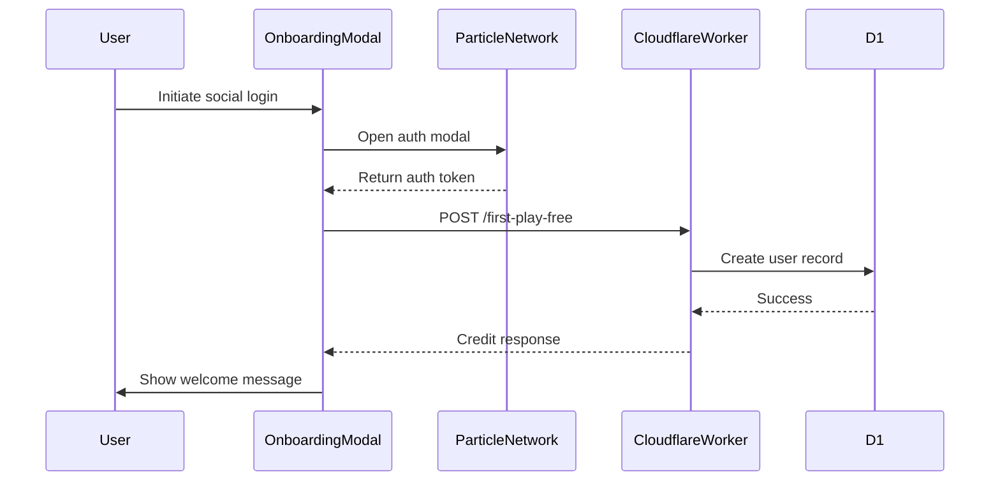
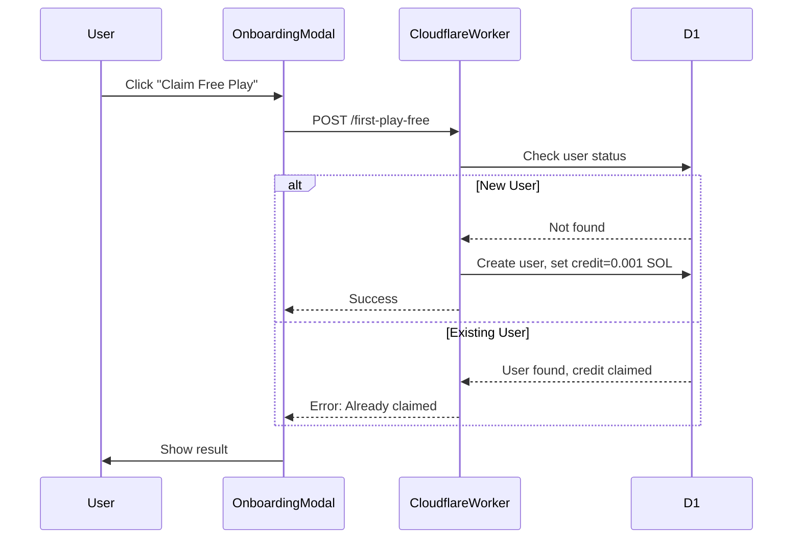
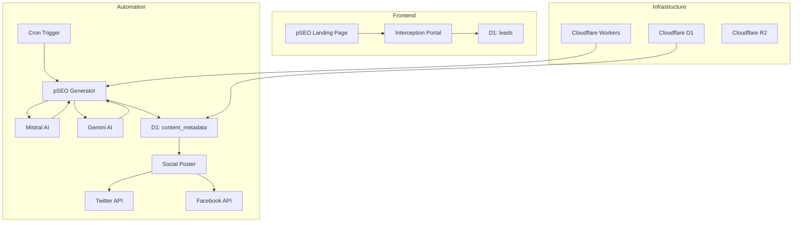

# Quantum Nexus Epic Architecture: Flash & Viral Engines

## 1. The Flash Experience & Onboarding Engine

### Component Interactions


### Data Flow Diagram: Onboarding Process


### Sequence Diagram: Social Login Flow


### Sequence Diagram: First Play Claim Flow


### Architecture Decision Record (ADR): Onboarding Flow

#### ADR 1: Particle Network for Authentication
**Status**: Accepted
**Context**:
Needed frictionless social login with self-custodial wallet creation
**Decision**:
Use Particle Network for social login and wallet creation
**Consequences**:
- ✅ Seamless onboarding with Google/Twitter/etc
- ✅ Automatic non-custodial wallet creation
- ⚠️ Adds third-party dependency

#### ADR 2: First Play Free Implementation
**Status**: Accepted
**Context**:
Need to give new users risk-free entry while preventing abuse
**Decision**:
Cloudflare Worker API with D1 persistence
**Consequences**:
- ✅ Serverless scalability
- ✅ SOL credit tracked per wallet address
- ⚠️ Requires wallet signature validation

#### ADR 3: Zustand for State Management
**Status**: Accepted
**Context**:
Need lightweight state sharing between onboarding and game components
**Decision**:
Use Zustand instead of Redux or Context API
**Consequences**:
- ✅ Minimal boilerplate
- ✅ Efficient re-renders
- ⚠️ Learning curve for new developers

#### ADR 4: API Error Handling
**Status**: Accepted
**Context**:
Need robust error handling for auth and credit claims
**Decision**:
Standardized error responses with Sonner toasts
**Consequences**:
- ✅ Consistent user experience
- ✅ Detailed error logging
- ⚠️ Additional frontend logic

### Integration Points
1. **Wallet Creation**:
   - Particle Network ↔ OnboardingModal
   - Creates self-custodial wallet during social login
   - Stores wallet publicAddress in Zustand store

2. **User Preferences**:
   - OnboardingModal ↔ Cloudflare Worker ↔ D1
   - Stores risk tolerance and game preferences
   - Used by Smart Bet for personalized suggestions

3. **Credit System**:
   - FirstPlayFree API ↔ D1 user_preferences
   - Tracks first play credit status per wallet
   - Prevents duplicate claims

4. **State Management**:
   - OnboardingModal ↔ Zustand UserStore
   - Propagates user state to GameRenderer
   - Maintains session across app

### Technology Stack Decisions
| Component | Technology | Justification |
|-----------|------------|---------------|
| UI Framework | Next.js 14 | SSR/SSG for performance, PWA support |
| Animation Library | React Three Fiber | High-performance 3D animations |
| State Management | Zustand | Lightweight global state for wallet/session |
| Auth Provider | Particle Network | Social login + self-custodial wallets |
| CSS Framework | Tailwind + Shadcn | Customizable design system |
| Serverless Backend | Cloudflare Workers | Zero cold start, edge computing |
| Database | Cloudflare D1 | Serverless SQL with SQLite compatibility |

### API Specifications
**Endpoint:** `POST /api/first-play-free`
```typescript
// Request
{
  "userToken": "particle_auth_token"
}

// Response
{
  "success": true,
  "creditAmount": 0.001 // SOL
}
```

**Endpoint:** `POST /api/smart-bet`
```typescript
// Request
{
  "gameId": "dice",
  "userAddress": "0x...",
  "riskProfile": "conservative"
}

// Response
{
  "suggestion": {
    "amount": 0.05,
    "multiplier": 1.8,
    "confidence": 0.85
  }
}
```

### Infrastructure Planning
1. **Frontend Deployment**: Cloudflare Pages with:
   - Automatic CI/CD from GitHub
   - Edge caching for static assets
   - Preview deployments for PRs
   
2. **Authentication Flow**:
   ```mermaid
   sequenceDiagram
       Frontend->>Particle Network: Initiate social login
       Particle Network-->>Frontend: Auth token
       Frontend->>Cloudflare Worker: POST /api/first-play-free
       Cloudflare Worker->>D1: Create user record
       Cloudflare Worker-->>Frontend: Credit response
   ```

3. **Performance Optimization**:
   - Next.js ISR for game pages
   - React Three Fiber code splitting
   - SWR for data fetching with stale-while-revalidate

---

## 2. The Viral Growth & AI Engine

### Component Diagram


### Technology Stack Decisions
| Component | Technology | Justification |
|-----------|------------|---------------|
| AI Text Generation | Mistral 7B | Cost-effective, high-quality output |
| AI Image Generation | Gemini Vision | Photorealistic event images |
| Social Posting | Twitter API v2 | Official supported integration |
| Database | Cloudflare D1 | SQL for relational metadata |
| Storage | Cloudflare R2 | S3-compatible for generated assets |
| Scheduling | Cloudflare Cron Triggers | Precise timing control |

### API Specifications
**AI Service Adapter Interface**:
```typescript
interface AIGenerateRequest {
  provider: 'mistral' | 'gemini';
  type: 'text' | 'image';
  prompt: string;
  params?: Record<string, any>;
}

// Usage in Worker
const aiResponse = await aiAdapter.generate({
  provider: 'mistral',
  type: 'text',
  prompt: `Generate SEO content for ${eventTitle} gambling opportunity`
});
```

**Social Poster Payload**:
```typescript
{
  "contentId": "d1_record_id",
  "platforms": ["twitter", "facebook"],
  "scheduleAt": "2025-06-25T14:30:00Z"
}
```

### Infrastructure Planning
1. **Content Generation Pipeline**:
   ```mermaid
   sequenceDiagram
       Cloudflare Cron->>Worker: Daily pSEO trigger
       Worker->>Mistral: Generate content
       Worker->>Gemini: Generate image
       Worker->>D1: Store metadata
       Worker->>Social Poster: Queue posts
   ```

2. **Scalability Considerations**:
   - Rate limiting with Cloudflare Workers
   - AI request batching
   - Content caching in R2
   - Database sharding by content type

3. **Cost Optimization**:
   - Free tier utilization
   - AI cache for similar queries
   - Compression of generated assets

---

## Database Schema Implementation
```sql
-- Updated schema.sql
CREATE TABLE leads (
    id TEXT PRIMARY KEY DEFAULT (uuid()),
    email TEXT UNIQUE NOT NULL,
    source TEXT NOT NULL,
    status TEXT DEFAULT 'new',
    interests TEXT,
    createdAt DATETIME DEFAULT CURRENT_TIMESTAMP,
    updatedAt DATETIME DEFAULT CURRENT_TIMESTAMP
);

CREATE TABLE content_metadata (
    id TEXT PRIMARY KEY DEFAULT (uuid()),
    urlPath TEXT UNIQUE NOT NULL,
    title TEXT NOT NULL,
    metaDescription TEXT,
    keywords TEXT,
    generatedHtml TEXT,
    imageUrl TEXT,
    generationDate DATETIME DEFAULT CURRENT_TIMESTAMP,
    socialPostIds TEXT, -- JSON array of post IDs
    impressions INTEGER DEFAULT 0,
    clicks INTEGER DEFAULT 0
);

CREATE TABLE user_preferences (
    walletAddress TEXT PRIMARY KEY UNIQUE NOT NULL,
    riskTolerance TEXT CHECK(riskTolerance IN ('low', 'medium', 'high')),
    preferredGames TEXT, -- JSON array of game IDs
    notificationSettings TEXT, -- JSON configuration
    lastLogin DATETIME DEFAULT CURRENT_TIMESTAMP
);
```

## Cross-Epic Integration Points
1. **Unified AI Adapter**:
   ```mermaid
   classDiagram
       class AIServiceAdapter {
           +generate(options: AIOptions) Promise<AIResponse>
       }
       SmartBetPanel --> AIServiceAdapter
       pSEOGenerator --> AIServiceAdapter
   ```

2. **Shared Data Flow**:
   ```mermaid
   graph LR
       A[Smart Bet Usage] --> B[user_preferences]
       C[pSEO Conversions] --> D[leads]
       B --> E[Personalized Suggestions]
       D --> F[Retargeting Campaigns]
   ```

3. **Security Framework**:
   - JWT authentication for all APIs
   - CSP headers for 3rd-party integrations
   - D1 row-level security
   - AI output sanitization