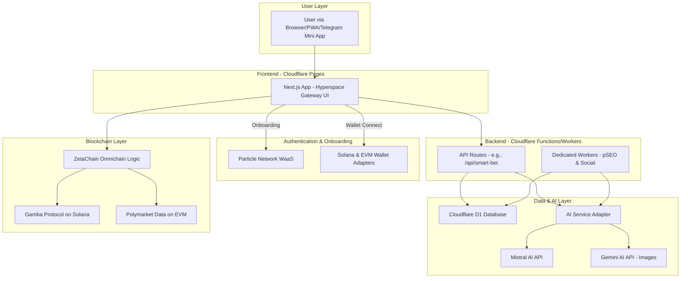

fullstack-architecture.md`

```markdown
# Quantum Nexus Fullstack Architecture Document - Flash & Viral Edition

## Introduction

This document outlines the complete fullstack architecture for Quantum Nexus, designed to deliver a high-impact, "flash and viral" universal dApp. The architecture extends the `bankkroll-gamba-v2-next.js.git` codebase, integrating ZetaChain for omnichain functionality, Particle Network for seamless user onboarding, and a powerful AI content engine, all deployed on the Cloudflare serverless ecosystem.

### Starter Template or Existing Project

The project is an enhancement of the `bankkroll-gamba-v2-next.js.git` repository. This architecture respects its existing Next.js, Gamba v2, and wallet adapter integrations, while layering on new services and a complete UI/UX overhaul.

### Change Log

| Date       | Version | Description      | Author  |
| :--------- | :------ | :--------------- | :------ |
| 2025-06-15 | 1.0     | Final "Flash & Viral" Edition | Winston |

## High Level Architecture

### Technical Summary

Quantum Nexus is architected as a serverless, omnichain application. The frontend is a Next.js application, enhanced with immersive 3D/UI animations, deployed on Cloudflare Pages. It utilizes Particle Network for social logins and self-custodial wallet management. Backend logic and automation are handled by Cloudflare Workers and Next.js API Routes, which interact with a Cloudflare D1 database, external blockchain protocols (Gamba, Polymarket data, ZetaChain), and a swappable AI engine for content and image generation.

### Platform and Infrastructure Choice

**Platform:** Cloudflare Ecosystem
**Key Services:**
*   **Cloudflare Pages:** Hosting for the Next.js frontend (SSG, ISR, SSR via Functions).
*   **Cloudflare Workers:** For dedicated backend automation (pSEO, social posting).
*   **Cloudflare D1:** Serverless SQL database.
*   **Cloudflare R2 / KV:** For asset storage and caching.
**Deployment Host and Regions:** Cloudflare's global edge network.

### Repository Structure

**Structure:** Monorepo, extending the existing `bankkroll-gamba-v2-next.js.git` project.
**New Directories:**
*   `workers/`: To house the source code for dedicated Cloudflare Workers (e.g., `pSeoGenerator/`, `socialPoster/`).
*   `infra/d1/`: To store SQL schema and migration files for Cloudflare D1.

### High Level Architecture Diagram



### Architectural and Design Patterns

- **Serverless-First:** All backend logic is encapsulated in serverless functions (API Routes) or dedicated workers to ensure scalability and cost-effectiveness.
- **Jamstack:** Leverage Next.js SSG/ISR for pSEO pages to ensure peak performance and SEO.
- **Adapter Pattern:** Implement a swappable "AI Service Adapter" to abstract LLM providers, allowing dynamic selection between Mistral, Gemini, etc.
- **Event-Driven Automation:** Use Cloudflare cron triggers and D1 database triggers to run backend automation workers asynchronously.

## Tech Stack

(The tech stack table from the previous detailed architecture document remains valid and accurate.)

## Database Schema

```sql
-- Table for Leads
CREATE TABLE IF NOT EXISTS leads (
    id TEXT PRIMARY KEY DEFAULT (uuid()),
    email TEXT UNIQUE NOT NULL,
    source TEXT NOT NULL,
    status TEXT DEFAULT 'new',
    interests TEXT,
    createdAt DATETIME DEFAULT CURRENT_TIMESTAMP,
    updatedAt DATETIME DEFAULT CURRENT_TIMESTAMP
);

-- Table for Content Page Metadata
CREATE TABLE IF NOT EXISTS content_metadata (
    id TEXT PRIMARY KEY DEFAULT (uuid()),
    urlPath TEXT UNIQUE NOT NULL,
    title TEXT NOT NULL,
    metaDescription TEXT,
    keywords TEXT,
    generatedHtml TEXT,
    imageUrl TEXT, -- Added for AI-generated images
    generationDate DATETIME DEFAULT CURRENT_TIMESTAMP,
    socialPostIds TEXT,
    impressions INTEGER DEFAULT 0,
    clicks INTEGER DEFAULT 0
);

-- Table for User Preferences
CREATE TABLE IF NOT EXISTS user_preferences (
    walletAddress TEXT PRIMARY KEY UNIQUE NOT NULL,
    riskTolerance TEXT,
    preferredGames TEXT,
    notificationSettings TEXT,
    lastLogin DATETIME DEFAULT CURRENT_TIMESTAMP
);
```

## Frontend Architecture

### Component Architecture

- **Reskinning:** Existing components in `src/components` will be restyled to match the "Cosmic Bloom" palette.
- **New Components:**
  - `src/components/layout/NexusOrb.tsx`: The interactive 3D navigation component.
  - `src/components/ui/InsightShard.tsx`: The animated game card replacement.
  - `src/components/forms/InterceptionPortal.tsx`: The animated lead capture form.
  - `src/components/game/SmartBetPanel.tsx`: The AI insight display panel.

### State Management Architecture

- **Global State:** Continue using `zustand` (`useUserStore`) for wallet info, user preferences, and session data.
- **Data Fetching:** Implement `SWR` or `react-query` for client-side data fetching and caching.

## Backend Architecture

### Service Architecture

- **API Routes (Cloudflare Functions):** Located in `src/pages/api/`, these handle synchronous requests from the frontend.
- **Dedicated Cloudflare Workers:** Located in `workers/`, these handle asynchronous, scheduled tasks.

### The "Swappable AI Engine" - AI Service Adapter

This critical component in `src/lib/ai/adapter.ts` will abstract LLM provider logic.

```typescript
// src/lib/ai/adapter.ts
interface AIOptions {
  provider: 'mistral' | 'gemini';
  task: 'text' | 'image';
  prompt: string;
}

class AIServiceAdapter {
  async generate(options: AIOptions) {
    // ... logic to switch between Mistral and Gemini ...
  }
}

export const aiAdapter = new AIServiceAdapter();```

## Unified Project Structure

```plaintext
bankkroll-gamba-v2-next.js.git/
├── workers/
│   ├── pSeoGenerator/
│   │   └── ...
│   └── socialPoster/
│       └── ...
├── infra/
│   └── d1/
│       └── schema.sql
├── src/
│   ├── components/
│   │   ├── layout/NexusOrb.tsx
│   │   └── ui/InsightShard.tsx
│   └── lib/
│       └── ai/adapter.ts
└── ... (rest of the existing structure)
```

## CI/CD Pipeline

The CI/CD pipeline in GitHub Actions will be expanded to include deployment steps for the new Cloudflare Workers.
