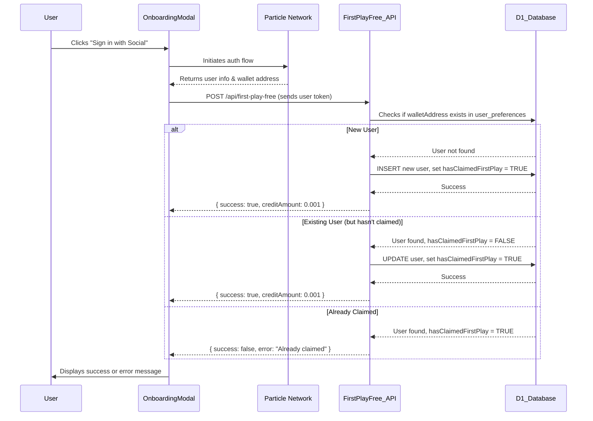
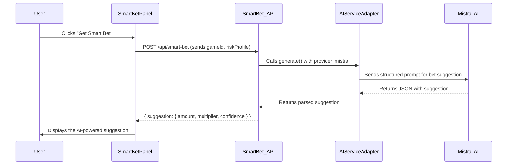
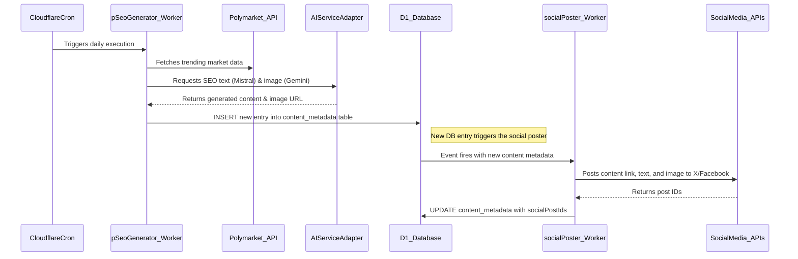

# Quantum Nexus Fullstack Architecture Document

## Introduction

This document outlines the complete fullstack architecture for Quantum Nexus, designed to deliver a high-impact, "flash and viral" universal dApp. It extends the `bankkroll-gamba-v2-next.js` codebase, integrating ZetaChain for omnichain functionality, Particle Network for seamless user onboarding, and a powerful AI content engine, all deployed on the Cloudflare serverless ecosystem. This document serves as the single source of truth for all technical implementation.

### Change Log

| Date | Version | Description | Author |
| :--- | :------ | :---------- | :----- |
|      | 1.0     | Final Release | Winston|

## High Level Architecture

### Technical Summary

Quantum Nexus is architected as a **serverless, omnichain application**. The frontend is a high-performance Next.js application, enhanced with immersive 3D/UI animations and deployed globally on **Cloudflare Pages**. It utilizes **Particle Network** for social logins and self-custodial wallet management across both Solana and EVM chains. Backend logic and automation are handled by a combination of Next.js API Routes (running on Cloudflare Functions) and dedicated **Cloudflare Workers**. All persistent state is managed by a **Cloudflare D1** SQL database. The entire system is orchestrated by **ZetaChain**, which acts as the messaging and value-transfer layer between the user's wallet, our application, and the various on-chain protocols like Gamba and Polymarket.

### Platform and Infrastructure Choice

**Platform:** **Cloudflare Ecosystem**
*   **Rationale:** The Cloudflare stack (Pages, Workers, D1, R2) provides a deeply integrated, highly performant, and globally distributed serverless environment. Its cost-effectiveness, especially the generous free tiers, directly supports our **NFR1** requirement for lean operations. The platform's native support for cron triggers and seamless Git-based deployments is ideal for our automation goals.

**Key Services:**
*   **Cloudflare Pages:** Hosting for the Next.js frontend (SSG, ISR, and SSR via integrated Functions).
*   **Cloudflare Workers:** For dedicated, asynchronous backend automation (pSEO, social posting).
*   **Cloudflare D1:** The serverless SQL database for all application metadata (`user_preferences`, `leads`, `content_metadata`).
*   **Cloudflare R2 / KV:** For AI-generated image asset storage and general caching, respectively.
**Deployment Host and Regions:** Cloudflare's global edge network (automatic).

### Repository Structure

**Structure:** **Monorepo**
*   **Rationale:** We will continue to build within the `bankkroll-gamba-v2-next.js` monorepo. This is critical for managing the complex interplay between the frontend UI, the Solana game logic, the new EVM-related logic for Polymarket, shared types, and our serverless backend code. A monorepo simplifies dependency management and ensures consistency.

**New Directories:**
*   `workers/`: To house the source code for our dedicated Cloudflare Workers (e.g., `pSeoGenerator/`, `socialPoster/`).
*   `infra/d1/`: To store SQL schema and migration files for Cloudflare D1.
*   `contracts/evm/`: To house the EVM smart contract source code to be handled by the specialized Smart Contract Agent.

### High Level Architecture Diagram
```mermaid
graph TD
    subgraph User & Onboarding Layer
        A[User via Browser/PWA/Telegram] --> B(Particle Network WaaS);
        B -- Social Login --> C{Self-Custodial Wallets <br>(SOL & EVM)};
    end

    subgraph Presentation Layer - Cloudflare Pages
        D[Next.js App - Quantum Nexus UI];
        C --> D;
    end

    subgraph Application & API Layer - Cloudflare Functions/Workers
        E[API Routes<br>/api/smart-bet<br>/api/first-play-free];
        F[Automation Workers<br>pSEO & Social Poster];
        D -- API Calls --> E;
        F -- Generates --> G[AI Service Adapter];
    end

    subgraph Data & AI Layer
        H[Cloudflare D1 SQL DB];
        G -- Uses --> I[Mistral AI];
        G -- Uses --> J[Gemini AI];
        E --> H;
    end

    subgraph Blockchain Abstraction Layer
        K[ZetaChain Omnichain Logic];
        D -- Blockchain TXs --> K;
    end
    
    subgraph On-Chain Protocols
        L[Gamba Protocol on Solana];
        M[Polymarket Protocol on EVM];
        K -- Relays TX to --> L;
        K -- Relays TX to --> M;
    end
```

### Architectural and Design Patterns

*   **Serverless-First:** All backend logic is encapsulated in serverless functions (API Routes) or dedicated workers to ensure scalability, zero-cold starts, and alignment with our lean cost model.
*   **Adapter Pattern (AI Engine):** Implement a swappable `AIServiceAdapter` in `src/services/aiAdapter.ts`. This abstracts away the specific LLM providers (Mistral, Gemini), making our system flexible and resilient to changes in the AI landscape.
*   **Event-Driven Automation:** Use Cloudflare cron triggers to run the pSEO generation worker on a schedule, and database triggers (or a queueing system) to activate the social posting worker when new content is created. This decouples our content pipeline from user-facing requests.
*   **Jamstack (for pSEO):** The AI-generated SEO pages will be pre-rendered as static assets (SSG/ISR) and served from Cloudflare's edge, ensuring maximum performance and crawlability for search engines.

## Tech Stack

The following table outlines the definitive technology choices for Quantum Nexus. All development must conform to this stack.

| Category                 | Technology                                | Rationale                                                                                                 |
| :----------------------- | :---------------------------------------- | :-------------------------------------------------------------------------------------------------------- |
| **Language**             | TypeScript                                | Provides type safety, which is critical for a complex, multi-chain application.                               |
| **Frontend Framework**   | Next.js 14+                               | Enables a high-performance frontend with SSG/ISR for SEO, and server components for our serverless strategy.    |
| **UI Library**           | React 18+                                 | The industry standard for building dynamic user interfaces, required by Next.js.                             |
| **UI Components**        | Shadcn UI & Tailwind CSS                  | A modern, highly customizable component library and utility-first CSS framework for rapid UI development.      |
| **State Management**     | Zustand                                   | A lightweight, simple, and un-opinionated state management solution perfect for our lean approach.          |
| **3D / Animation**       | React Three Fiber & drei                  | Essential for delivering the "flash" experience, providing powerful, performant 3D graphics and animations. |
| **Backend**              | Next.js API Routes & Cloudflare Workers | Unifies frontend/backend logic and fully embraces our serverless-first, edge-native architecture.              |
| **Database**             | Cloudflare D1                             | A serverless SQL database that integrates natively with Cloudflare Workers for fast, global data access.     |
| **Asset Storage**        | Cloudflare R2                             | S3-compatible object storage with zero egress fees, ideal for hosting AI-generated images and other assets.  |
| **Omnichain Layer**      | ZetaChain                                 | The core protocol for abstracting away blockchain complexity and enabling seamless cross-chain transactions.  |
| **Onboarding & Wallet**  | Particle Network                          | Provides frictionless social login and self-custodial wallet infrastructure for both Solana and EVM chains. |
| **Gaming Protocol**      | Gamba Protocol V2 (on Solana)             | The foundational on-chain gaming protocol from the existing codebase.                                        |
| **Prediction Market**    | Polymarket Protocol (on Polygon)          | The leading prediction market protocol we will integrate for our betting engine.                                |
| **AI - Text Generation** | Mistral AI                                | High-performance and cost-effective text generation, ideal for pSEO content and "Smart Bet" suggestions.   |
| **AI - Image Generation**| Gemini AI (or similar)                    | Chosen for its ability to generate high-quality, realistic images for our automated social marketing.          |
| **Deployment & Hosting** | Cloudflare Pages / Workers                | Provides a seamless, Git-based CI/CD workflow, global edge deployment, and the serverless runtime.            |
| **Testing**              | Jest, React Testing Library, Playwright   | A robust stack for unit, integration, and end-to-end testing to meet our quality assurance requirements.     |

## Data Models

This section defines the core data models for Quantum Nexus. These models will be implemented as tables in our Cloudflare D1 SQL database. The schema is designed to be lean and efficient, supporting our MVP features while allowing for future expansion.

### Database Schema (SQL)

The following `schema.sql` will be stored in `infra/d1/schema.sql` and used for D1 migrations.

```sql
-- Table for capturing leads from pSEO pages
CREATE TABLE leads (
    id TEXT PRIMARY KEY DEFAULT (uuid()),
    email TEXT UNIQUE NOT NULL,
    source TEXT NOT NULL, -- e.g., 'pSEO-event-slug', 'homepage-cta'
    status TEXT DEFAULT 'new',
    interests TEXT, -- JSON array of interests, e.g., ['sports', 'gaming']
    createdAt DATETIME DEFAULT CURRENT_TIMESTAMP,
    updatedAt DATETIME DEFAULT CURRENT_TIMESTAMP
);

-- Table for storing metadata of AI-generated content
CREATE TABLE content_metadata (
    id TEXT PRIMARY KEY DEFAULT (uuid()),
    urlPath TEXT UNIQUE NOT NULL, -- e.g., '/seo/super-bowl-odds'
    title TEXT NOT NULL,
    metaDescription TEXT,
    keywords TEXT, -- Comma-separated list of keywords
    generatedHtml TEXT,
    imageUrl TEXT, -- URL to the AI-generated image in Cloudflare R2
    generationDate DATETIME DEFAULT CURRENT_TIMESTAMP,
    socialPostIds TEXT, -- JSON array of post IDs from Twitter/Facebook APIs
    impressions INTEGER DEFAULT 0,
    clicks INTEGER DEFAULT 0
);

-- Table for storing user-specific data and preferences
CREATE TABLE user_preferences (
    walletAddress TEXT PRIMARY KEY UNIQUE NOT NULL,
    riskTolerance TEXT CHECK(riskTolerance IN ('low', 'medium', 'high')),
    preferredGames TEXT, -- JSON array of game IDs
    notificationSettings TEXT, -- JSON configuration for future use
    hasClaimedFirstPlay BOOLEAN DEFAULT FALSE,
    referralCredits REAL DEFAULT 0,
    lastLogin DATETIME DEFAULT CURRENT_TIMESTAMP
);
```

### Data Flow & Relationships

*   **`user_preferences`**: This is the central user table, keyed by the user's wallet address provided by Particle Network. It will be created or updated during the "First Play Free" onboarding flow. It stores essential data for features like "Smart Bet" (using `riskTolerance` and `preferredGames`).
*   **`leads`**: This table is populated by the "Interception Portal" on our pSEO pages. It is designed to capture potential users who are not yet ready to connect a wallet but are interested in the platform.
*   **`content_metadata`**: This table powers our entire pSEO engine. The `pSeoGenerator` worker writes new entries here, and the `socialPoster` worker is triggered by these new entries. The Next.js frontend dynamically renders pages based on the `urlPath`.

## Components

The Quantum Nexus application is composed of several key components across the frontend and backend. These components are designed to be modular and have clear responsibilities, facilitating parallel development and maintainability.

### Frontend Components (Next.js)

*   **`ParticleProviderWrapper` (`src/components/ParticleProviderWrapper.tsx`)**
    *   **Responsibility:** The highest-level client component. It initializes and configures the Particle Network and Gamba providers, making authentication and wallet interactions available to the entire application. This component is crucial for abstracting wallet logic.
*   **`OnboardingModal` (`src/components/onboarding/OnboardingModal.tsx`)**
    *   **Responsibility:** Manages the entire new user journey. It prompts users for social login via Particle, triggers the `/api/first-play-free` API call upon success, and guides the user through their initial "wow" experience.
*   **`GameRenderer` (`src/components/game/GameRenderer.tsx`)**
    *   **Responsibility:** A master component that dynamically loads and displays the selected game (either a Gamba game or the Polymarket interface). It ensures a consistent layout and provides targets for game controls and the main screen view.
*   **`SmartBetPanel` (New Component)**
    *   **Responsibility:** A UI component present on Gamba game pages. It contains the "Smart Bet" button, calls the `/api/smart-bet` API, and displays the AI-generated suggestion to the user.
*   **`PolymarketModule` (New Component)**
    *   **Responsibility:** A dedicated module for all Polymarket interactions. It fetches market data from the `polymarketService`, displays it to the user, and orchestrates the on-chain betting transactions via the EVM smart contract integration.
*   **pSEO Page Renderer (`src/pages/seo/[slug].tsx`)**
    *   **Responsibility:** A dynamic Next.js page that fetches content from the `content_metadata` D1 table based on the URL slug. It uses Server-Side Generation (SSG) with Incremental Static Regeneration (ISR) for maximum SEO performance.

### Backend Components (Serverless Functions)

*   **`first-play-free` API (`src/pages/api/first-play-free.ts`)**
    *   **Responsibility:** A serverless API route that handles new user registration. It validates the user's Particle token, checks the D1 database to prevent duplicate claims, creates a new `user_preferences` record, and returns the "first play free" credit status.
*   **`smart-bet` API (`src/pages/api/smart-bet.ts`)**
    *   **Responsibility:** A serverless API route that connects to the AI Service Adapter. It receives a game ID and user risk profile, queries the AI model for a bet suggestion, and returns the suggestion to the frontend.
*   **`pSeoGenerator` Worker (`workers/pSeoGenerator/`)**
    *   **Responsibility:** An automated, cron-triggered Cloudflare Worker. It fetches trending topics from Polymarket, generates SEO-optimized text and images via the AI Service Adapter, and saves the new content to the `content_metadata` D1 table.
*   **`socialPoster` Worker (`workers/socialPoster/`)**
    *   **Responsibility:** An automated Cloudflare Worker triggered by new entries in the D1 database. It takes the newly generated content and posts it to social media platforms like X and Facebook via their respective APIs.

### Service & Abstraction Components

*   **`aiAdapter` (`src/services/aiAdapter.ts`)**
    *   **Responsibility:** A critical backend service that provides a unified interface for interacting with various AI models (Mistral, Gemini). It abstracts away the specific API calls, allowing the rest of the application to request AI generation without needing to know which provider is being used.
*   **ZetaChain & EVM Contract Layer (to be built)**
    *   **Responsibility:** This layer, to be developed by the specialized Smart Contract Agent, will abstract all on-chain interactions. The Next.js frontend will make calls to this layer to execute transactions on Gamba (Solana) and Polymarket (EVM) via ZetaChain's omnichain capabilities.

## Core Workflows

This section illustrates the key user and system workflows, showing how the architectural components interact to achieve the goals defined in the PRD.

### 1. New User Onboarding & First Play Free Flow

**Goal:** Onboard a new user via social login, create their wallet, and credit them with a free play.



### 2. AI-Powered "Smart Bet" Suggestion Flow

**Goal:** A user requests and receives an AI-driven bet suggestion for a Gamba game.



### 3. Automated pSEO Content Generation & Social Posting

**Goal:** Automatically generate and publish SEO-optimized content to attract new users.



## Unified Project Structure

This directory structure outlines the organization of our monorepo. Adhering to this structure is essential for maintaining a clean, scalable, and manageable codebase.

```plaintext
quantum-nexus/
├── .github/                     # CI/CD workflows (e.g., deploying workers)
│   └── workflows/
├── contracts/                   # Smart contracts
│   └── evm/                     # EVM contracts for Polymarket integration (handled by Smart Contract Agent)
├── docs/                        # Project documentation (Brief, PRD, Architecture)
├── infra/                       # Infrastructure definitions
│   └── d1/                      # Cloudflare D1
│       └── schema.sql           # Database schema
├── public/                      # Static assets
├── src/                         # Main Next.js application source
│   ├── components/
│   │   ├── game/                # Core Gamba game UI components
│   │   ├── layout/              # Header, Footer, etc.
│   │   ├── onboarding/
│   │   │   └── OnboardingModal.tsx
│   │   ├── polymarket/          # New components for Polymarket UI
│   │   │   └── MarketList.tsx
│   │   └── ui/                  # Shadcn UI components
│   ├── games/                   # Gamba game implementations
│   ├── hooks/                   # Custom React hooks
│   ├── pages/
│   │   ├── api/                 # Serverless API Routes
│   │   │   ├── first-play-free.ts
│   │   │   └── smart-bet.ts
│   │   ├── polymarket.tsx       # New Polymarket page
│   │   └── seo/
│   │       └── [slug].tsx       # Dynamic pSEO page renderer
│   ├── services/
│   │   ├── aiAdapter.ts         # The swappable AI Service Adapter
│   │   └── polymarketService.ts # Service for fetching Polymarket data
│   └── ...                      # Other existing directories
├── workers/                     # Source for dedicated Cloudflare Workers
│   ├── pSeoGenerator/
│   │   └── index.ts
│   └── socialPoster/
│       └── index.ts
├── package.json
├── tailwind.config.ts
└── tsconfig.json
```

---

This completes my role in architecting the solution. I'll now hand you back to **Olivia** to discuss the next steps and potentially engage our **Product Owner (PO)**, Sarah, to validate that the full plan aligns with our business goals before development begins. This is Winston, signing off.
