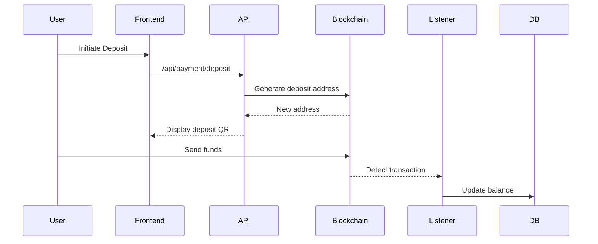

# Epic 2: Payment Gateway Integration

## Objective
Implement secure cryptocurrency payment processing supporting multiple chains and tokens.

## Key Features
- Multi-chain deposit/withdrawal support (EVM, Solana, TON)
- Real-time exchange rate tracking via Chainlink
- Fraud detection system with 3D Secure equivalent
- Tax calculation and reporting module
- Multi-sig wallet integration for cold storage

## Acceptance Criteria
1. Support 5+ major cryptocurrencies (BTC, ETH, SOL, TON, USDC)
2. <100ms response time for balance queries
3. <1% transaction failure rate under load
4. Automated tax form generation for users
5. PCI-DSS compliant encryption for all transactions

## Technical Guidance

**MCP Verification Requirements:**
1. Semgrep scan for security vulnerabilities
2. Brave-search for latest crypto regulations
3. GitHub code search for payment pattern validation