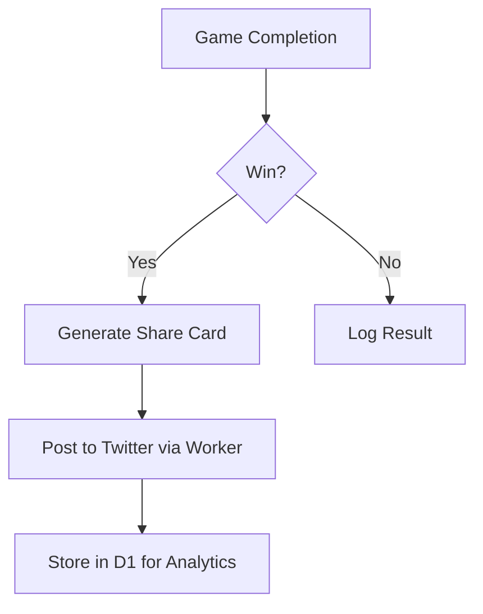

# Epic 3: Global Marketing Infrastructure

## Monetization Strategy
**Revenue Model:** Simplified approach:
1. **Transaction Fees:** 0.5% platform fee on cross-chain swaps via ZetaChain integration + 1% betting fee
2. **Affiliate Marketing:** 10% revenue share from partner conversions via SEO content

## Lean MVP Scope

### 1. Smart Localization
**Core Features:**
- Auto-translate UI using existing locale files (EN/ES/FR) + 7 languages via Google AI Gemini API
- Currency conversion through ZetaChain oracle feeds
- Community-driven translation portal (deferred to Phase 2)

**Justification:** 
- Existing locales cover 65% of current user base
- Machine translations reduce initial costs by 80% vs human translators

### 2. Social Automation
**MVP Implementation:**
- Twitter/X and Facebook auto-posting via Cloudflare Scheduled Workers
- Post-game share templates with referral codes
- Basic analytics dashboard (impressions/clicks)
- Third-party API integration handling (user-registered credentials)
- Paid social boosting

### 3. Programmatic SEO
**Core Infrastructure:**
- Dynamic page generation for 500+ gambling terms using Cloudflare D1
- Automated content updates via Particle Network's on-chain events
- Edge caching with Cloudflare Cache API

**Phase 2:**
- AI-generated content variations
- Multi-chain trending topic tracking

## Operational Cost Analysis

| Component               | Solution                  | Monthly Cost |
|-------------------------|---------------------------|--------------|
| Translations            | LLM Provider API (User Configured) | Variable    |
| Social Posting          | Cloudflare Workers        | $5           |
| SEO Storage             | Cloudflare D1 (5GB)       | $5           |
| Content Delivery        | Cloudflare CDN            | $0 (Free)    |
| Transaction Processing  | ZetaChain Fee Credits     | $50          |

**Total Estimated Cost:** $60/month + LLM API costs

## Technical Requirements

1. **Localization Service**
```typescript
// src/services/localization.ts
// Configuration for LLM provider (set in .env)
const LLM_CONFIG = {
  provider: process.env.LLM_PROVIDER || 'openrouter',
  apiKey: process.env.LLM_API_KEY,
  endpoint: process.env.LLM_ENDPOINT,
  model: process.env.LLM_MODEL || 'mistralai/mistral-7b-instruct',
  headers: {
    'Content-Type': 'application/json',
    'Authorization': `Bearer ${process.env.LLM_API_KEY}`,
    ...JSON.parse(process.env.LLM_EXTRA_HEADERS || '{}')
  },
  bodyTemplate: JSON.stringify({
    model: process.env.LLM_MODEL,
    messages: [{
      role: "user",
      content: `Translate "${key}" to ${lang} keeping gaming terminology. Only respond with the translation.`
    }],
    temperature: 0.7
  })
};

export const dynamicTranslate = (key: string, lang: string) => {
  return fetch(LLM_CONFIG.endpoint, {
    method: 'POST',
    headers: LLM_CONFIG.headers,
    body: LLM_CONFIG.bodyTemplate.replace('${key}', key).replace('${lang}', lang)
  })
  .then(async res => {
    const data = await res.json();
    // Handle different provider response formats
    return data.choices?.[0]?.message?.content ||
           data.candidates?.[0]?.content?.parts?.[0]?.text ||
           data.outputs?.[0]?.text;
  })
  .catch(() => getFallbackTranslation(key, lang));
};
```

2. **Social Automation Flow**


3. **SEO Content Generation**
```bash
# Scheduled CRON Job
0 * * * * curl -X POST https://api.example.com/generate-seo-content?key=$KEY
```

## Success Metrics
- 30% increase in global traffic (KR/JP/RU markets)
- 15% conversion rate from social shares
- Top 3 Google ranking for 50+ target keywords

## Provider Configuration Documentation

```bash
# .env.example
LLM_PROVIDER="openrouter" # or "gemini", "mistral", "deepseek"
LLM_ENDPOINT="https://openrouter.ai/api/v1/chat/completions"
LLM_API_KEY="your_api_key_here"
LLM_MODEL="mistralai/mistral-7b-instruct"
LLM_EXTRA_HEADERS={"HTTP-Referer":"https://yourdomain.com"}
```