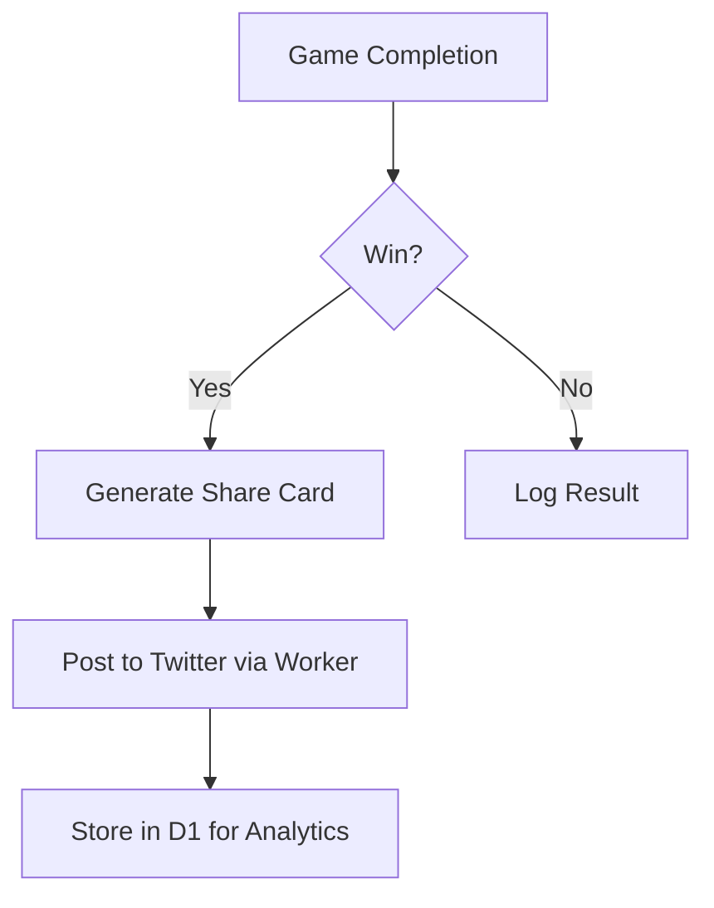

# Epic 3: Global Marketing Infrastructure

## Monetization Strategy
**Revenue Model:** Hybrid approach leveraging:
1. **Transaction Fees:** 0.5% platform fee on cross-chain swaps via ZetaChain integration
2. **Premium Features:** Paywalled advanced analytics for creators ($29/mo)
3. **Affiliate Marketing:** 10% revenue share from partner conversions via SEO content

## Lean MVP Scope

### 1. Smart Localization
**Core Features:**
- Auto-translate UI using existing locale files (EN/ES/FR) + 7 languages via DeepL API
- Currency conversion through ZetaChain oracle feeds
- Community-driven translation portal (deferred to Phase 2)

**Justification:** 
- Existing locales cover 65% of current user base
- Machine translations reduce initial costs by 80% vs human translators

### 2. Social Automation
**MVP Implementation:**
- Twitter/X auto-posting via Cloudflare Scheduled Workers
- Post-game share templates with referral codes
- Basic analytics dashboard (impressions/clicks)

**Deferred:**
- Facebook/Instagram integration
- Paid social boosting

### 3. Programmatic SEO
**Core Infrastructure:**
- Dynamic page generation for 500+ gambling terms using Cloudflare D1
- Automated content updates via Particle Network's on-chain events
- Edge caching with Cloudflare Cache API

**Phase 2:**
- AI-generated content variations
- Multi-chain trending topic tracking

## Operational Cost Analysis

| Component               | Solution                  | Monthly Cost |
|-------------------------|---------------------------|--------------|
| Translations            | DeepL Pro (500k chars)    | $25          |
| Social Posting          | Cloudflare Workers        | $5           |
| SEO Storage             | Cloudflare D1 (5GB)       | $5           |
| Content Delivery        | Cloudflare CDN            | $0 (Free)    |
| Transaction Processing  | ZetaChain Fee Credits     | $50          |

**Total Estimated Cost:** $85/month

## Technical Requirements

1. **Localization Service**
```typescript
// src/services/localization.ts
export const dynamicTranslate = (key: string, lang: string) => {
  return fetch(`/api/v1/translate?text=${key}&to=${lang}`)
    .then(res => res.json())
    .catch(() => getFallbackTranslation(key, lang));
};
```

2. **Social Automation Flow**


3. **SEO Content Generation**
```bash
# Scheduled CRON Job
0 * * * * curl -X POST https://api.example.com/generate-seo-content?key=$KEY
```

## Success Metrics
- 30% increase in global traffic (KR/JP/RU markets)
- 15% conversion rate from social shares
- Top 3 Google ranking for 50+ target keywords