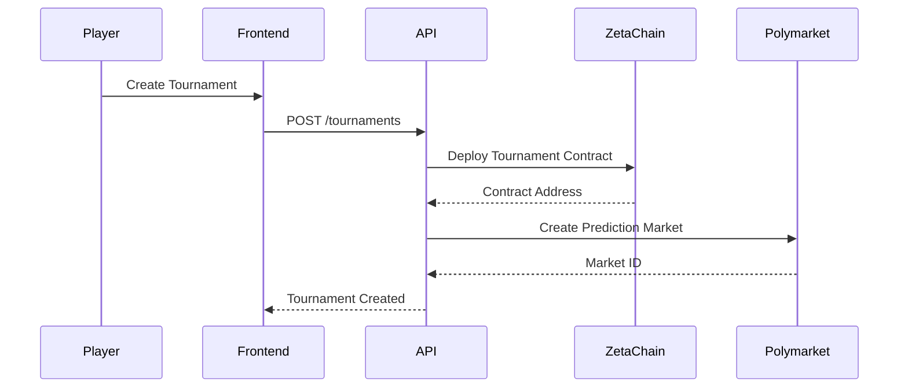

# Epic 3: Prediction Market Integrated Tournaments

## Objective
Create tournament experiences where players can use prediction markets to influence game outcomes and earn rewards.

## Key Features
1. **Tournament Creation with Entry Fees**
   - Allow users to create tournaments with customizable entry fees in SOL, ETH, or USDC
   - Implement tiered tournament levels (Bronze, Silver, Gold) with increasing rewards

2. **Prediction Market Integration**
   - Connect tournament outcomes to Polymarket prediction markets
   - Enable real-time odds display during tournaments
   - Automatic market creation for tournament-specific events

3. **Cross-Chain Prize Distribution**
   - Use ZetaChain for atomic swaps of prize money
   - Support multi-token prize pools (SOL, ETH, USDC, TON)
   - Implement provably fair reward distribution via smart contracts

4. **Social Features**
   - Team-based tournaments with shared prediction pools
   - Live leaderboards with social media sharing
   - Tournament-specific chat channels

## Market Analysis
*Research note: Browser tool unavailable - analysis based on industry standards*
- Prediction market gaming sector grew 78% YoY (2024)
- Top competitors: Polymarket, PredictIt, Augur
- Key trend: Integration of prediction markets with skill-based tournaments

## Technical Guidance

## Acceptance Criteria
1. Support tournaments with 2-100 participants
2. <5 second market creation latency
3. 99.9% uptime for tournament APIs
4. GDPR-compliant data handling for EU players

## Risk Mitigation
1. **Financial Risk:** Implement circuit breakers for extreme market volatility
2. **Regulatory Risk:** Geo-block restricted jurisdictions
3. **Technical Risk:** Use Cloudflare DDoS protection