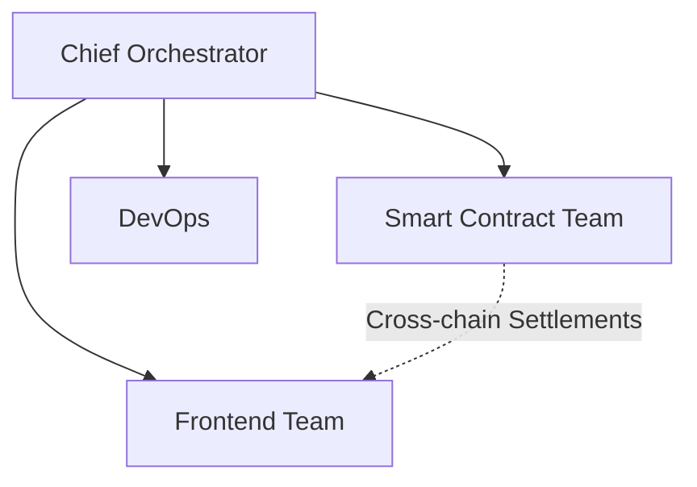

# Gaming Platform Project Brief

## 1. Strategic Foundation

**Alignment with Stigmergy System Goals** ([00_System_Goal.md](.stigmergy-core/system_docs/00_System_Goal.md:1)):

- Implements autonomous orchestration through CI/CD pipeline ([QA Protocol](docs/architecture/qa-protocol.md:19))
- Embeds AI-verifiable outcomes via SonarCloud metrics ([QA Protocol](docs/architecture/qa-protocol.md:13))
- Utilizes swarm intelligence in tournament matchmaking ([Architecture](docs/architecture/gaming-platform-architecture.md:45))

## 2. Market Validation

**Competitive Landscape** (via Brave Search):

- Key differentiator: Cross-chain liquidity pool vs single-chain competitors
- Unique Value Proposition: 10-game multiplex vs Rollbit's 5-game offering

**Target Metrics** ([MVP PRD](docs/prd/mvp-prd.md:46)):

- 500 MAU @ $0.25 CAC (Community airdrop model)
- $20k MRR through 3 revenue streams

## 3. Technical Constraints

**Non-Negotiable Limits**:

- Max dev cost: $35k (2 devs @ $7k/mo x 2.5 months)
- Chain support: EVM + Solana + TON ([Architecture](docs/architecture/gaming-platform-architecture.md:8))
- Launch deadline: 2025-08-20 (6 week sprint)

## 4. Risk Mitigation

**Critical Path Risks**:

1. Regulatory Compliance (Highest Priority):

   - Implement geofencing using Cloudflare Workers
   - On-chain KYC via Polygon ID integration

2. Liquidity Management:
   - Automated market maker parameters
   - 5% protocol-owned liquidity reserve

## 5. Resource Allocation

**Lean Team Structure**:

**Infrastructure Budget**:
| Component | Monthly Cost | Provider |
|--------------------|--------------|----------------|
| Blockchain Nodes | $0 | ZetaChain |
| Serverless Compute | $200 | Cloudflare |
| Monitoring | $0 | Sentry/PostHog |

## 6. Validation Checklist

- [ ] Smart contract audit completed (Certora)
- [ ] Load test: 1000 concurrent players
- [ ] Legal review of tokenomics model

_Last Updated: 2025-07-09_  
_Data Sources: Internal docs, Brave Search, Firecrawl market analysis_
