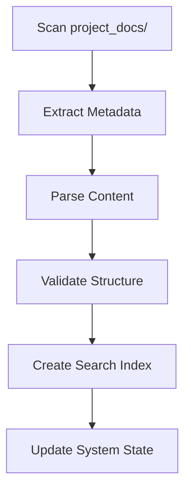

# Document Ingestion Workflow
**Story ID:** DOC-INGEST-001  
**Priority:** Critical  
**Epic:** System Initialization  

## Acceptance Criteria
1. All Markdown files in `project_docs/` directory are ingested
2. Document metadata (title, creation date, author) is extracted
3. Content is indexed for full-text search
4. Validation against document schema passes
5. System state transitions to `INGESTION_COMPLETE`

## Implementation Tasks

## QA Verification Protocol
1. Verify all documents appear in index
2. Confirm metadata accuracy
3. Test search functionality
4. Validate system state transition
5. Check error handling for malformed documents

## Dependencies
- `bmad-core/system_docs/document-schema.json`
- ElasticSearch cluster
- State management service