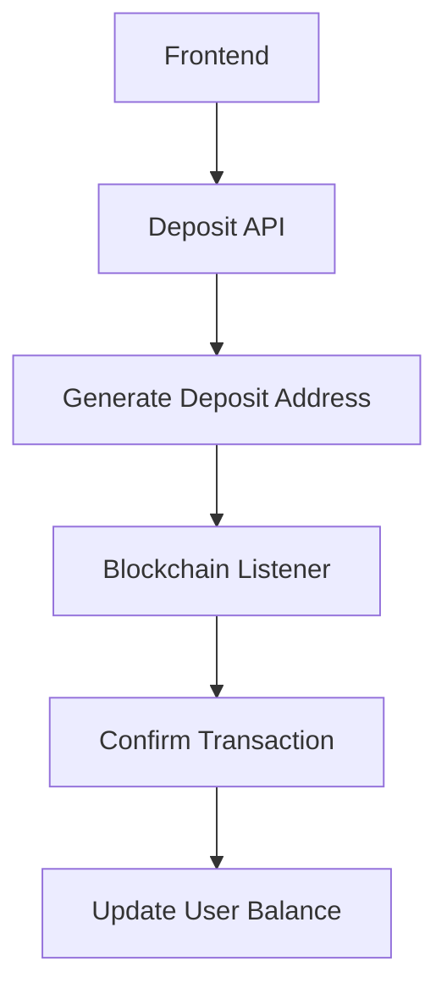

# Story: Multi-Crypto Payment Support

**Epic:** Payment Gateway Integration

## User Story
As a player, I want to deposit funds using multiple cryptocurrencies so I can use my preferred digital assets.

## Acceptance Criteria
1. Support EVM (ETH, USDC), Solana (SOL), and TON blockchain deposits
2. Generate unique deposit addresses for each user/currency
3. Auto-detect deposits within 2 minutes
4. Display deposit history with 10+ confirmations
5. Handle failed transactions with error messaging

## Technical Guidance

**Required MCP Checks:**
1. Semgrep: Security scan for payment processing
2. GitHub: Validate address generation patterns
3. Brave-search: Latest crypto regulations