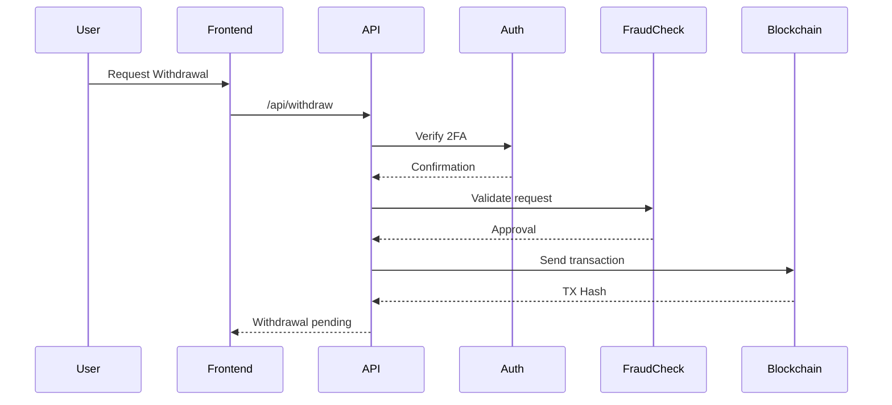

# Story: Withdrawal Request System

**Epic:** Payment Gateway Integration

## User Story
As a player, I want to withdraw my winnings to my external wallet securely and efficiently.

## Acceptance Criteria
1. Support withdrawals for 5+ cryptocurrencies
2. 2FA verification for all withdrawals
3. Automated fraud detection checks
4. Transaction status tracking with blockchain explorers
5. Daily withdrawal limit of $10,000 per user

## Technical Guidance

**Required MCP Checks:**
1. Semgrep: Security audit of withdrawal logic
2. GitHub: Validate transaction signing patterns
3. Brave-search: Latest FATF travel rule compliance