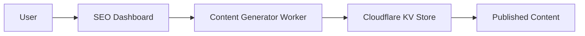

# Story: SEO Content Management Interface

**Epic:** UX Overhaul

## User Story
As a marketing manager, I need an SEO content dashboard to manage programmatic SEO content so we can optimize search rankings.

## Acceptance Criteria
1. Dashboard showing SEO performance metrics (impressions, clicks, rankings)
2. Content calendar for scheduled SEO article publishing
3. Keyword performance tracking with trend analysis
4. Integration with Cloudflare Workers for edge caching
5. Automated content generation via API triggers

## Technical Guidance

**Required Components:**
- Next.js admin dashboard
- Cloudflare Workers for content generation
- D1 database for content storage
- Brave-search for keyword research