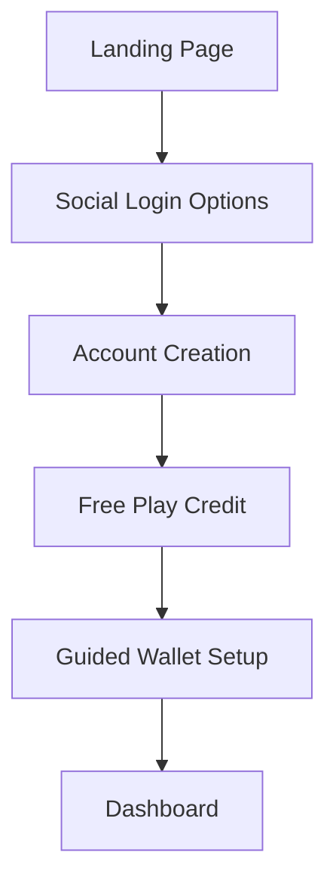
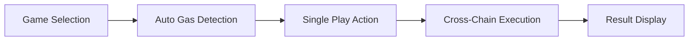

# Particle Network UX Specification

## 1. Introduction

This document outlines the user experience patterns for integrating Particle Network into Quantum Nexus. The integration leverages Particle's Universal Accounts, Session Keys, and Gas Abstraction to create a seamless multi-chain gaming experience.

## 2. Core Principles

- **Chain Abstraction**: Hide blockchain complexity from users
- **Social-First**: Enable frictionless onboarding via social logins
- **Unified Assets**: Aggregate cross-chain balances in single view
- **Session Security**: Time-bound permissions for enhanced security

## 3. Key User Flows

### 3.1 Onboarding Flow



### 3.2 Gameplay Flow



## 4. UI Patterns

### 4.1 Unified Account Dashboard (`AccountDashboard.tsx`)

- **Purpose**: Show aggregated assets across chains
- **Components**:
  - Balance cards (EVM/Solana/TON)
  - Session key status indicator
  - Network switcher
- **Visual Design**:
  

### 4.2 Session Manager (`SessionManager.tsx`)

- **Controls**:
  - Duration slider (1h/8h/24h)
  - Auto-renew toggle
  - Active session indicator
- **Security Features**:
  - Auto-logout on expiration
  - Session revocation option

### 4.3 Gas Abstraction Module (`GasAbstractionModule.ts`)

- **Functionality**:
  - Auto gas token detection
  - Cross-chain fee estimation
  - One-click transaction approval
- **User Feedback**:
  - Real-time cost conversion
  - Transaction progress indicators

### 4.4 Universal Play Button (`GambaPlayButton.tsx`)

- **Enhancements**:
  - Chain-agnostic operation
  - Smart error handling
  - Unified action label ("Play")
- **States**:
  - Disabled (insufficient balance)
  - Loading (transaction processing)
  - Success/Failure indicators

## 5. Component Specifications

| Component             | Purpose                   | Props                         | Dependencies                 |
| --------------------- | ------------------------- | ----------------------------- | ---------------------------- |
| `AccountDashboard`    | Cross-chain asset display | `user`, `chains`              | `useParticleBalance`         |
| `SessionManager`      | Session key controls      | `sessionDuration`, `onChange` | `useSessionKeys`             |
| `GasEstimator`        | Transaction cost display  | `chainId`, `transactionType`  | `useGasAbstraction`          |
| `UniversalPlayButton` | Chain-agnostic gameplay   | `game`, `amount`              | `useParticleSendTransaction` |

## 6. Accessibility Requirements

- WCAG 2.1 AA compliance
- Color contrast ratio 4.5:1 minimum
- Keyboard navigable controls
- Screen reader support for all components

## 7. Success Metrics

- 30% reduction in onboarding time
- 25% increase in first-time player retention
- 40% decrease in failed transactions
- 15% increase in cross-chain interactions

## 8. Implementation Timeline

```gantt
gantt
    title Particle Network Integration
    dateFormat  YYYY-MM-DD
    section UX Components
    Account Dashboard      :2025-07-12, 3d
    Session Manager        :2025-07-15, 2d
    Gas Abstraction        :2025-07-17, 3d
    Universal Play Button  :2025-07-20, 2d
    section Testing
    QA Pass 1              :2025-07-22, 3d
    User Testing           :2025-07-25, 4d
    Launch                 :2025-07-30, 1d
```
