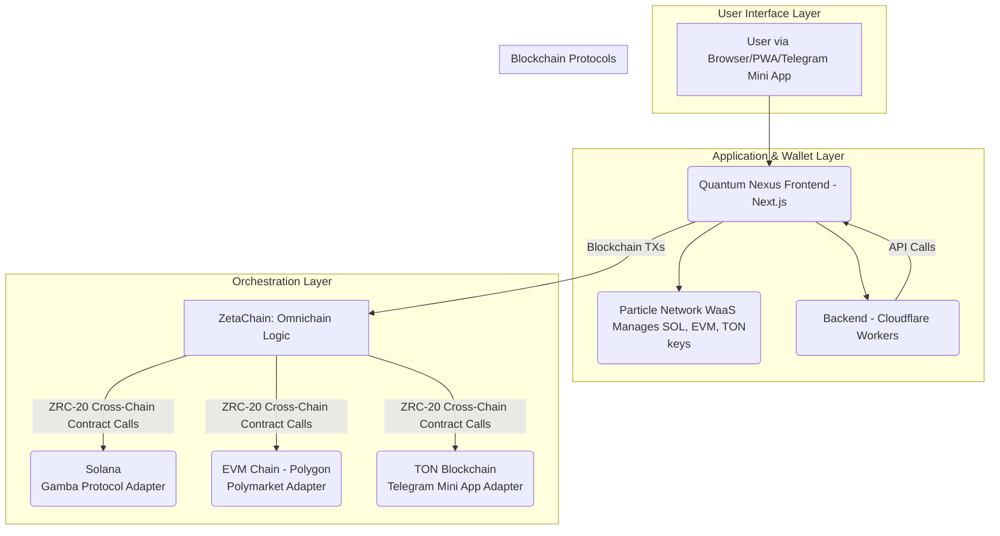

### FILE: 02-architecture.md

# System Architecture: Quantum Nexus

## 1. High-Level Design

Quantum Nexus is architected as a **serverless, omnichain application** built on the Cloudflare ecosystem. This model ensures global scalability, high performance, and cost-efficiency. The application is designed to be delivered as a standard web application, a **Progressive Web App (PWA)**, and a **Telegram Mini App**.

-   **Frontend:** A high-performance Next.js application deployed on **Cloudflare Pages**. It handles all user-facing interactions, including the immersive "Hyperspace Gateway" UI and 3D animations.
-   **Backend & APIs:** A hybrid backend combines **Next.js API Routes** (for synchronous requests like Smart Bet) and dedicated **Cloudflare Workers** (for asynchronous, automated tasks like pSEO content generation and social media posting).
-   **User Management & Wallets:** **Particle Network's Wallet-as-a-Service (WaaS)** provides seamless social logins, creating and managing self-custodial wallets for users across Solana, EVM chains, and **TON**.
-   **Omnichain Orchestration:** **ZetaChain** serves as the central messaging and value-transfer layer. It abstracts away blockchain complexity, allowing the frontend to interact with on-chain protocols like Gamba (Solana), Polymarket (EVM), and TON-based services through a unified interface.

### Architecture Diagram



## 2. Data Models

The data persistence layer is a **Cloudflare D1** SQL database. The schema is defined as follows:

-   **`leads`**: Captures potential user leads from pSEO landing pages and other marketing initiatives.
    ```sql
    CREATE TABLE leads (
        id TEXT PRIMARY KEY DEFAULT (uuid()),
        email TEXT UNIQUE NOT NULL,
        source TEXT NOT NULL,
        status TEXT DEFAULT 'new',
        interests TEXT,
        createdAt DATETIME DEFAULT CURRENT_TIMESTAMP,
        updatedAt DATETIME DEFAULT CURRENT_TIMESTAMP
    );
    ```

-   **`content_metadata`**: Stores all metadata for the AI-generated pSEO pages and social media posts, powering the viral growth engine.
    ```sql
    CREATE TABLE content_metadata (
        id TEXT PRIMARY KEY DEFAULT (uuid()),
        urlPath TEXT UNIQUE NOT NULL,
        title TEXT NOT NULL,
        metaDescription TEXT,
        keywords TEXT,
        generatedHtml TEXT,
        imageUrl TEXT,
        generationDate DATETIME DEFAULT CURRENT_TIMESTAMP,
        socialPostIds TEXT, -- JSON array of post IDs
        impressions INTEGER DEFAULT 0,
        clicks INTEGER DEFAULT 0
    );
    ```

-   **`user_preferences`**: The central user table, keyed by wallet address. It stores preferences and state for features like Smart Bet and First Play Free.
    ```sql
    CREATE TABLE user_preferences (
        walletAddress TEXT PRIMARY KEY UNIQUE NOT NULL,
        riskTolerance TEXT CHECK(riskTolerance IN ('low', 'medium', 'high')),
        preferredGames TEXT, -- JSON array of game IDs
        notificationSettings TEXT, -- JSON configuration
        lastLogin DATETIME DEFAULT CURRENT_TIMESTAMP,
        hasClaimedFirstPlay BOOLEAN DEFAULT FALSE,
        referralCredits REAL DEFAULT 0,
        smartBet BOOLEAN DEFAULT TRUE
    );
    ```
```
