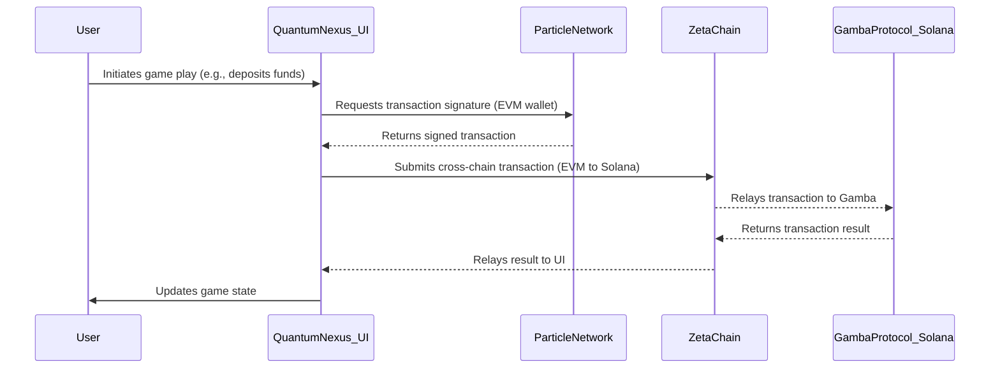
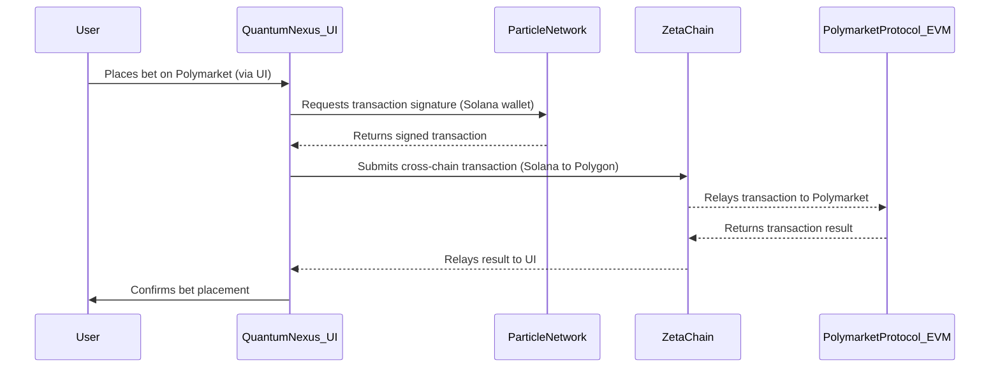

# Quantum Nexus Cross-Chain Architecture

## Introduction

This document details the cross-chain architecture of Quantum Nexus, focusing on how it leverages ZetaChain and Particle Network to enable seamless interactions across Solana, EVM (Polygon), and TON blockchains. The goal is to provide a truly omnichain experience for users, abstracting away the underlying blockchain complexities.

## Core Principles

*   **Omnichain Abstraction:** ZetaChain serves as the primary abstraction layer, allowing the application to interact with various blockchain protocols without direct knowledge of their native complexities.
*   **Seamless User Experience:** Particle Network provides a unified wallet and authentication solution, enabling users to manage assets and sign transactions across multiple chains with a single social login.
*   **Protocol Agnostic Interaction:** The architecture is designed to be flexible, allowing for the integration of new blockchain protocols and dApps with minimal changes to the core application logic.

## Key Components

### 1. ZetaChain Omnichain Logic

*   **Role:** The central orchestrator for all cross-chain messaging and value transfer. ZetaChain's smart contracts (ZRC-20) facilitate communication and asset movement between connected blockchains.
*   **Integration Points:**
    *   **Frontend (Next.js):** Initiates cross-chain transactions by interacting with ZetaChain's SDK or our custom ZetaChain & EVM Contract Layer.
    *   **On-Chain Protocols:** Relays transactions to target protocols (Gamba on Solana, Polymarket on EVM, TON-based services).

### 2. Particle Network Wallet-as-a-Service (WaaS)

*   **Role:** Provides self-custodial wallet management and social login capabilities across Solana, EVM, and TON chains. It simplifies user onboarding and interaction with decentralized applications.
*   **Integration Points:**
    *   **`ParticleProviderWrapper` (`src/components/ParticleProviderWrapper.tsx`):** Initializes and configures Particle Network, making wallet interactions available throughout the application.
    *   **`OnboardingModal` (`src/components/onboarding/OnboardingModal.tsx`):** Manages the social login and wallet creation process for new users.

### 3. On-Chain Protocol Adapters

*   **Gamba Protocol (on Solana):**
    *   **Role:** The foundational on-chain gaming protocol. Cross-chain interactions with Gamba are facilitated via ZetaChain.
*   **Polymarket Protocol (on EVM - Polygon):**
    *   **Role:** The prediction market protocol integrated for betting. Cross-chain interactions with Polymarket are handled via ZetaChain and our EVM smart contract integration.
*   **TON Testnet (Telegram Mini App Adapter):**
    *   **Role:** Enables integration with TON-based services and provides functionality for the Telegram Mini App. Cross-chain interactions with TON are facilitated via ZetaChain.

### 4. ZetaChain & EVM Contract Layer (to be built)

*   **Role:** This layer will abstract all on-chain interactions, providing a unified interface for the Next.js frontend to execute transactions on Gamba (Solana) and Polymarket (EVM) via ZetaChain's omnichain capabilities. This layer will also handle interactions with TON-based services.

## Cross-Chain Workflows

### 1. Cross-Chain Game Play (Example: Gamba on Solana via EVM Wallet)

### 2. Cross-Chain Prediction Market Betting (Example: Polymarket on Polygon via Solana Wallet)

## Future Considerations

*   **Expanded Blockchain Support:** The architecture is designed to easily integrate additional blockchains as needed, by adding new protocol adapters and configuring ZetaChain.
*   **Cross-Chain Asset Swaps:** Future enhancements could include direct cross-chain asset swaps facilitated by ZetaChain, improving liquidity and user flexibility.