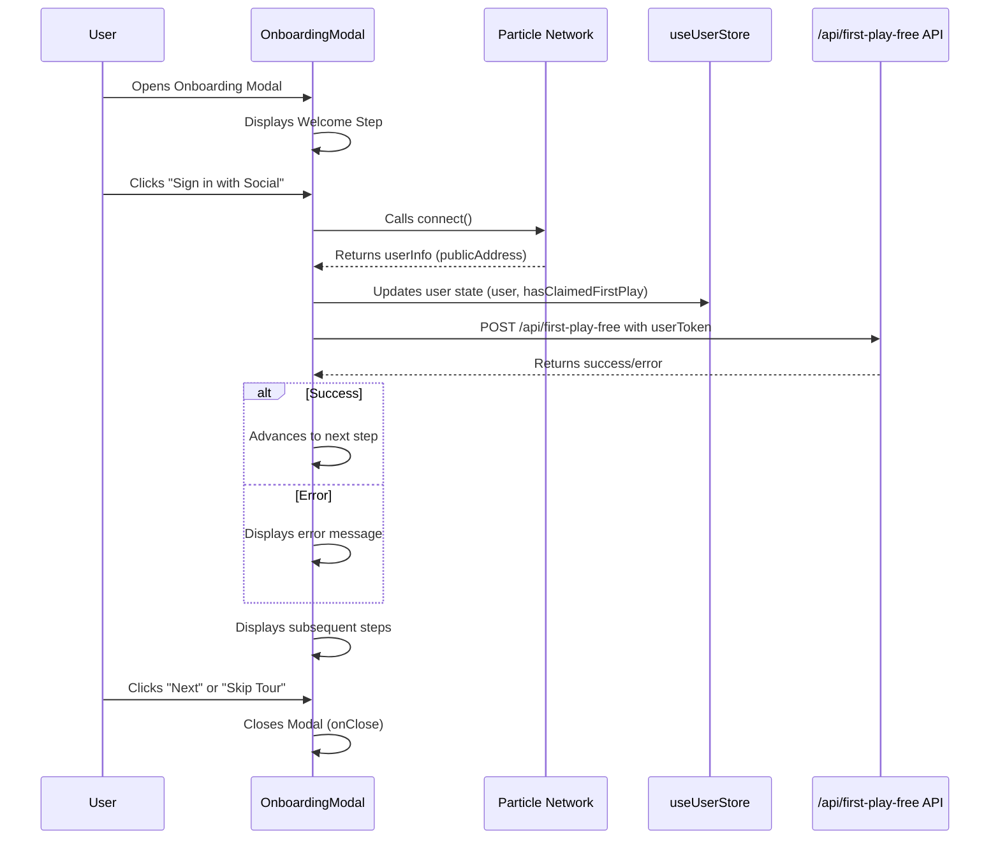

# Technical Design Documentation: Flash Experience Onboarding Engine

This document provides a comprehensive technical design for the 'Flash Experience' onboarding engine, detailing its architecture, component interactions, and state management.

## 1. Introduction

*   **Purpose:** To provide a quick, seamless, and engaging onboarding experience for new users, guiding them through social login and encouraging their first game play.
*   **Goals:**
    *   Rapid user registration via social login.
    *   Successful claim of the "first free play."
    *   Effective introduction to core platform features (e.g., Smart Bets).
*   **Scope:** This document covers the client-side onboarding flow, its interaction with authentication services (Particle Network), and the backend API for claiming the first free play.

## 2. Architecture Overview

The Flash Experience onboarding engine is primarily a client-side driven modal component that orchestrates user interaction, authentication, and initial feature introduction. It integrates with external services for social login and a custom API for first-play credit.

```mermaid
graph TD
    A[User] --> B(Client Application - Frontend)
    B --> C{OnboardingModal Component}
    C --> D[Particle Network (Social Login)]
    C --> E[useUserStore (State Management)]
    C --> F[API: /api/first-play-free]
    D --> G[Authentication Service]
    F --> H[Backend Service (Credit Management)]
    E --> B
```

## 3. Component Breakdown

*   **`OnboardingModal.tsx`**: The central React component responsible for rendering the multi-step onboarding flow.
    *   **Props:** `isOpen` (boolean), `onClose` (function).
    *   **State:** `currentStep` (number), `errorMessage` (string | null).
    *   **Dependencies:**
        *   `@particle-network/connect-react-ui`: For social login functionality (`useParticleConnect`).
        *   `@/hooks/useUserStore`: For global user state management (`user`, `hasClaimedFirstPlay`).
        *   `../ui/dialog`, `../ui/button`: UI components.
        *   `sonner`: For toast notifications.
    *   **Key Logic:** Manages step progression, initiates social login, calls the first-play API, and conditionally renders content based on the current step and user's claimed status.

## 4. Component Interactions

The `OnboardingModal` orchestrates interactions between several key parts of the application:



## 5. State Management

*   **Local State (`OnboardingModal.tsx`):**
    *   `currentStep`: Manages the active step in the onboarding flow.
    *   `errorMessage`: Stores any error messages to be displayed to the user.
*   **Global State (`useUserStore`):**
    *   `user`: Stores the authenticated user's information (e.g., `userInfo.publicAddress`).
    *   `hasClaimedFirstPlay`: A boolean flag indicating whether the user has already claimed their first free play. This is crucial for conditionally skipping the "Your First Free Play" step.
    *   **Interaction:** The `OnboardingModal` updates `useUserStore` upon successful social login and API calls. The modal also reacts to changes in `user` and `hasClaimedFirstPlay` to automatically close if the user is already onboarded.

## 6. User Journeys

#### 6.1. New User Registration & First Free Play Claim

1.  **Modal Display:** User opens the application, `OnboardingModal` is displayed (initial state, `currentStep = 0`).
2.  **Social Login Prompt:** User is prompted to "Sign in with Social."
3.  **Particle Network Integration:** User clicks the button, `handleSocialLogin` is invoked, calling `connect()` from Particle Network.
4.  **Authentication & State Update:** Upon successful authentication, `userInfo` is received. The `user` and `hasClaimedFirstPlay` states in `useUserStore` are updated.
5.  **First Play API Call:** A `POST` request is made to `/api/first-play-free` with the user's `publicAddress`.
6.  **Credit & Progression:** If the API call is successful, the user is credited, and the modal advances to the next step (`handleNext()`).
7.  **Error Handling:** If social login or API call fails, an `errorMessage` is set and displayed, and a toast notification appears.

#### 6.2. Introduction to Core Features

1.  **Step Progression:** After claiming the first free play (or if already claimed), the modal progresses through subsequent steps.
2.  **Feature Highlights:** Each step (`Your First Free Play`, `Smart Bets with AI`, `Explore and Enjoy!`) presents a brief description of a key feature.
3.  **Completion:** On the final step, the "Next" button changes to "Start Playing!", closing the modal upon click.

## 7. Error Handling

*   **Client-side Validation:** Basic error handling for missing user info from Particle Network.
*   **API Error Handling:** Catches errors from the `/api/first-play-free` endpoint, displays a user-friendly `errorMessage` within the modal, and shows a `toast.error` notification.
*   **Particle Network Errors:** Catches exceptions from `particle-network/connect-react-ui` and displays them.

## 8. Future Considerations/Improvements

*   **Dynamic Steps:** Allow steps to be configured dynamically from a backend or a configuration file.
*   **A/B Testing:** Implement A/B testing capabilities for different onboarding flows.
*   **Analytics Integration:** Add more detailed analytics events to track user progression and drop-off points within the onboarding flow.
*   **Deep Linking:** Support deep linking into specific onboarding steps or features.