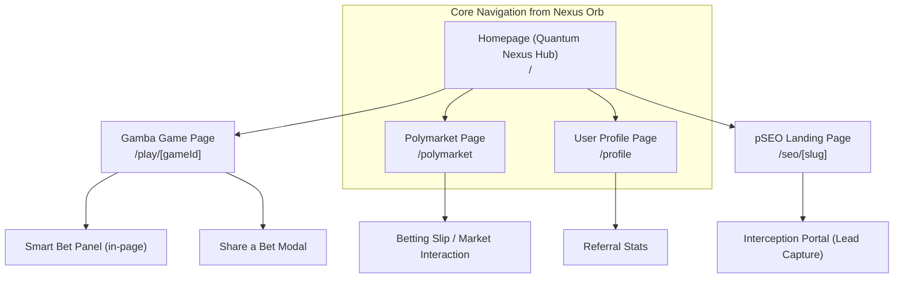

# Quantum Nexus UI/UX Specification

## Introduction

This document defines the user experience goals, information architecture, user flows, and visual design specifications for the Quantum Nexus user interface. It serves as the foundation for all visual design and frontend development, ensuring a cohesive, empowering, and user-centered experience that stands out from generic crypto applications.

### Overall UX Goals & Principles

Our core goal is to create an immersive, intuitive, and empowering experience that positions Quantum Nexus as a high-tech control center for decentralized finance and gaming. The UI/UX itself is a core product feature designed to deliver a "wow" factor, drive user retention, and fuel viral growth.

### Target User Personas

*   **Primary User - The "Chain-Agnostic Opportunist":** Experienced Web3 participants who value efficiency, security, and a unified interface to manage assets and opportunities across multiple blockchains. They will appreciate advanced features presented with clarity.
*   **Secondary User - The "Crypto-Curious Mainstream User":** Newcomers to Web3 who are easily intimidated by technical complexity. They value simplicity, trust, and familiar onboarding flows like social login. The UX must feel as seamless as a top-tier Web2 application.

### Usability Goals

*   **Ease of Learning ("Time to Wow"):** A new user must be able to complete their first core task (e.g., connect wallet, claim free play) within **3 minutes** of landing on the site.
*   **Efficiency of Use:** Experienced users should be able to navigate between games, markets, and their profile with minimal friction and clicks.
*   **Error Prevention:** The UI must provide clear validation, confirmations for critical actions (especially bets), and intuitive feedback to prevent user error.
*   **Value Perception:** The UI itself must immediately communicate intelligence, cutting-edge technology, and a premium, unique experience that builds trust and excitement.

### Design Principles

1.  **Clarity Over Cleverness:** All interactions must be immediately understandable.
2.  **Progressive Disclosure:** Manage complexity by revealing advanced options only when necessary.
3.  **Consistent Patterns:** Use familiar UI patterns, elevated by our unique visual style, to ensure predictability.
4.  **Immediate & Fluid Feedback:** Every user action must have a clear, immediate, and often beautifully animated response.
5.  **Accessible by Default:** Design for all users from the start, considering color contrast, keyboard navigation, and screen reader support.
6.  **Futuristic & Empowering:** The aesthetic should evoke a sense of high-tech control and strategic advantage, making the user feel powerful.
7.  **Digital Esoterica:** Embrace unique visual metaphors (the "Nexus Orb," "Insight Shards") and custom SVG animations to create a distinct and memorable brand identity.

### Change Log

| Date | Version | Description | Author |
| :--- | :------ | :---------- | :----- |
| 2025-06-27 | 1.0     | Final Version | Sally  |

## Information Architecture (IA)

### Site Map / Screen Inventory

The application follows a hub-and-spoke model, with the Homepage acting as the central nexus for all key activities.



### Navigation Structure

*   **Primary Navigation (The "Nexus Orb"):** Our primary navigation is not a traditional header bar. Instead, it will be an interactive 3D **"Nexus Orb"** element, persistently accessible. On click, it will unfurl a holographic radial menu with glowing icons, providing access to the main sections:
    *   **Gamba Games** (links back to the Homepage game grid)
    *   **Polymarket**
    *   **Profile**
    *   *Insights (Future, disabled/greyed out in MVP)*
*   **Secondary Navigation:** We will avoid traditional secondary navigation (like sidebars) to maintain an immersive feel. Contextual actions will be integrated directly into the UI where needed (e.g., a "Control Console" on game pages).
*   **Breadcrumb Strategy:** Not required for the MVP's relatively flat architecture. Clear "Back" or "Close" controls will be used to exit specific views like a game page.

## User Flows

### New User Onboarding & First "Smart Bet"

**User Goal:** A new user lands on the homepage, connects their wallet via social login with zero friction, and experiences the "wow" factor of receiving an AI-driven bet suggestion.
**Entry Points:** Homepage (`/`), direct link from social media, or a referral link.
**Success Criteria:** The user's wallet is created and connected, they have received their "First Play Free" credit, and they have successfully received an AI bet suggestion.

#### Flow Diagram
```mermaid
graph TD
    A[User lands on Homepage] --> B{Clicks "Sign In with Social"};
    B --> C[Particle Network UI Appears];
    C -- User completes Google/X login --> D{Wallet Created & Connected};
    D --> E[OnboardingModal triggers API call to /api/first-play-free];
    E --> F[API confirms new user, returns success];
    F --> G[UI confirms "First Play Free" credit is active];
    G --> H{User navigates to a Gamba Game page};
    H --> I{User clicks "Get Smart Bet"};
    I --> J[Smart Bet Panel displays AI suggestion];
```

**Edge Cases & Error Handling:**
*   **Wallet connection failure:** Display a non-intrusive toast notification with a "Retry" option.
*   **"First Play Free" API error:** The onboarding modal will show a user-friendly error (e.g., "Credit claim failed, please try again") and log the detailed error for debugging.
*   **"Smart Bet" API error:** The button shows a subtle error state (e.g., a red glow) with a tooltip, "Insights currently unavailable."

### Viral Loop: Sharing a Bet

**User Goal:** After a winning play, the user easily shares their success, which brings a new user to the platform via a referral link.
**Entry Points:** The "results" modal after a winning play in a Gamba game.
**Success Criteria:** A unique referral link is generated and copied, and the new user who clicks it is correctly attributed to the referrer.

#### Flow Diagram
```mermaid
graph TD
    subgraph Referrer's Journey
        A[User wins a Gamba Game] --> B{Results Modal Appears};
        B --> C{User clicks "Share This Bet"};
        C --> D[Unique referral URL is copied to clipboard];
        D --> E[User pastes link on social media];
    end

    subgraph New User's Journey
        F[New user sees social post and clicks link] --> G["Lands on Quantum Nexus with referral code in URL"];
        G --> H[Referral code is automatically stored in local state/cookie];
        H --> I[Proceeds with normal Onboarding Flow];
        I --> J{API call to /api/first-play-free also logs the referral attribution};
    end
```

## Wireframes & High-Level Layouts

While detailed, pixel-perfect mockups will be created in Figma (or a similar tool), this section defines the conceptual layout and key elements of our primary screens.

### Key Screen Layouts

#### 1. Homepage (The Cosmic Nexus Hub)
*   **Purpose:** To be an immersive and dynamic entry point that immediately communicates the high-tech, engaging nature of the platform and funnels users into our core product offerings.
*   **Key Elements:**
    *   **Background:** An animated "Quantum Fabric" or starfield effect.
    *   **Navigation:** The interactive 3D **"Nexus Orb"** is the central navigation element.
    *   **Main Content:** A grid of large, visually rich **"Insight Shards"** (our animated Game/Market Cards).
    *   **Social Proof:** A live feed or carousel of "Recent Plays" with subtle win/loss animations.

#### 2. Game/Market Detail Page (The "Probability Tunnel")
*   **Purpose:** To create an immersive and focused environment for gameplay and betting, free from distraction.
*   **Key Elements:**
    *   **Background:** A dynamic, game-specific theme. For multiplier games like Crash, this will be the "Probability Tunnel" of glowing data lines that react to the game state.
    *   **Main Content:** The game or market interface itself takes center stage.
    *   **Interactive Panels:**
        *   **"Smart Bet Panel":** A sleek, integrated panel with the glowing "Get Smart Bet" button.
        *   **"Control Console":** A footer element containing the wager input, play button, and other essential controls, styled to look like a futuristic interface.

#### 3. pSEO Landing Page
*   **Purpose:** A minimalist, fast-loading, and highly conversion-focused page designed to capture organic search traffic.
*   **Key Elements:**
    *   **Hero Section:** A powerful, SEO-optimized headline with a subtle text animation (e.g., a "glitch" or "flicker" effect).
    *   **Lead Capture:** The **"Interception Portal"** – a visually striking form that animates into view as the user scrolls or shows exit intent.

## Component Library / Design System

Our approach is to use **Shadcn UI** as a robust, accessible, and unstyled base for core components, but heavily customize them with our unique "Cosmic Bloom" theme and enhance them with bespoke animations using CSS and React Three Fiber.

### Core Custom Components

*   **`Button`:** On hover, it must emanate a "Quantum Violet" glow. On click, it will trigger a ripple/energy pulse animation. Destructive action buttons will use "Neon Charge" Yellow for their glow effect.
*   **`Modal`:** Will be used for the "Interception Portal" (Lead Capture) and for displaying details like "Provably Fair" information. It must slide in with a subtle holographic shimmer effect.
*   **`Card` (as "Insight Shard"):** The primary component for displaying games and markets. It will be multi-layered and semi-translucent. On hover, the layers must subtly separate, revealing an inner glow, giving it a 3D effect.
*   **`Navigation` (as "Nexus Orb"):** The interactive 3D navigation element. This is a complex component that will require significant work with React Three Fiber. It is not a standard nav bar.

## Branding & Style Guide

### Visual Identity
The brand identity is **futuristic, high-tech, data-driven, and empowering**. We must avoid generic "crypto" aesthetics in favor of a unique, premium feel.

### Color Palette: "Cosmic Bloom"
| Color Type | Hex/RGBA | Usage |
| :--- | :--- | :--- |
| **Background** | `#0A0B12` (Deep Space)| Main app background for depth and immersion. |
| **Primary** | `#8851FF` (Quantum Violet)| Primary interactive elements, glows, highlights. |
| **Secondary** | `#00FFFF` (Electric Cyan) | Secondary actions, sub-highlights, data streams. |
| **Accent/Win** | `#FFEC63` (Neon Charge) | Win states, critical alerts, high-impact CTAs. |
| **Text** | `rgba(255, 255, 255, 0.9)` | Main readable text. |
| **Muted Text** | `rgba(255, 255, 255, 0.5)` | Subheadings, descriptions, secondary info. |
| **Borders** | `rgba(255, 255, 255, 0.2)` | Subtle outlines for components and sections. |

### Typography
*   **UI Text:** A modern, clean, and highly legible sans-serif font (e.g., Inter, Be Vietnam Pro).
*   **Headlines:** A geometric or condensed sans-serif font to enhance the futuristic, high-tech feel (e.g., Rajdhani, Orbitron).
*   **Monospace:** A clean monospace font for displaying figures and wallet addresses.

### Iconography
Lucide React will be used for standard icons. However, key interactive elements (like the Nexus Orb icons) should be custom-designed and animated SVGs.

## Animation & Micro-interactions

### Motion Principles
*   **Purposeful:** Animations must enhance usability and provide meaningful feedback, not just add clutter.
*   **Fluid:** All animations should be smooth and interruptible.
*   **Data-Driven:** Where possible, animations should reflect the underlying state of the application (e.g., the "Probability Tunnel").

### Key Animations
1.  **"Hyperspace Jump" Page Transitions:** A fast, star-stretching warp effect for transitions between major pages.
2.  **"Nexus Orb" Navigation:** The orb unfurls into a holographic radial menu with a smooth, fluid motion.
3.  **"Insight Shard" Hover Effect:** Cards lift and separate on hover, revealing an inner glow.
4.  **"Probability Tunnel" Background:** An animated background of data streams for multiplier games that accelerates and intensifies as the multiplier increases.
5.  **"Interception Portal" Form Animation:** The lead capture form animates into view and has interactive effects on focus and submission.

## Performance Considerations

### Performance Goals
*   **Page Load:** Core pages must achieve a Largest Contentful Paint (LCP) of **under 2.5 seconds**.
*   **Interaction to Next Paint (INP):** All user interactions must have an INP of **under 200 milliseconds**.
*   **Animation FPS:** All animations must maintain a stable **60 FPS** on modern devices.

### Design & Development Strategies
*   All 3D assets (like the Nexus Orb model) must be highly optimized (low polygon count, compressed textures).
*   Utilize code-splitting to lazy-load non-critical components, especially heavy 3D scenes.
*   Prioritize CSS animations for simple effects; use React Three Fiber/WebGL only for complex 3D and particle animations.
*   Implement visual regression testing in our CI/CD pipeline to catch performance-degrading changes.
