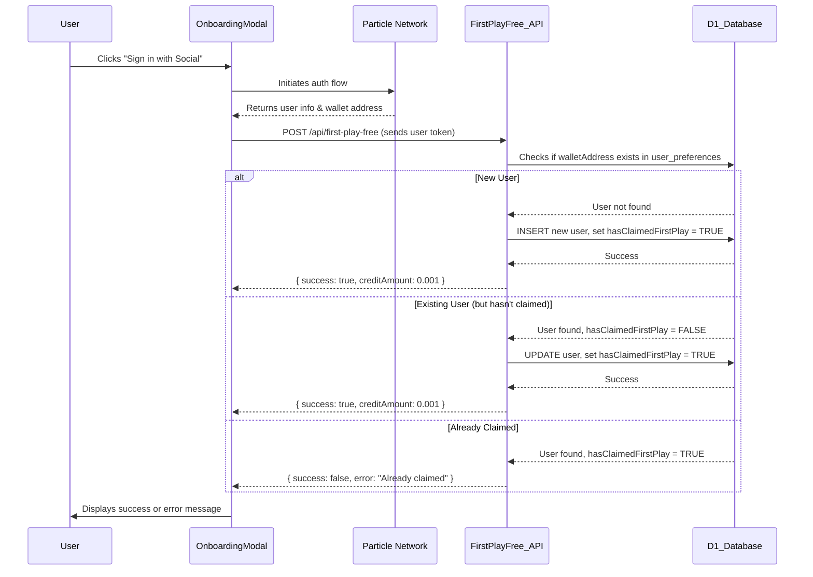
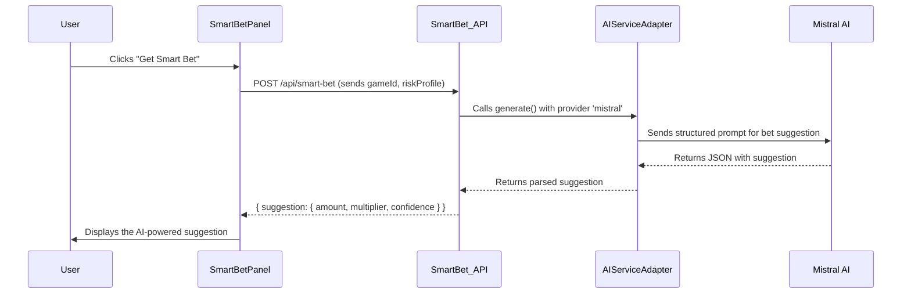
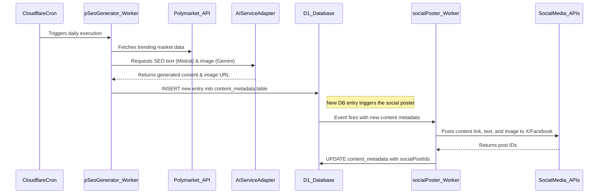
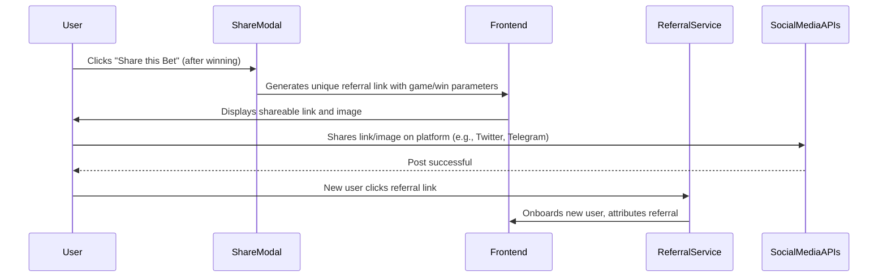

# Viral Growth & AI Engine Technical Design Documentation

## Introduction

This document details the technical design of the 'Viral Growth & AI Engine', a critical component for user acquisition and retention in the Quantum Nexus project. It focuses on the implementation of incentive structures, AI-driven personalization, and social sharing mechanics to create a self-propelling growth loop.

## High-Level Overview

The Viral Growth & AI Engine leverages Particle Network for frictionless user onboarding, Cloudflare Workers for automated content generation and social posting, Cloudflare D1 for persistent data storage, and various AI models via a swappable AI Service Adapter. This integrated system is designed to maximize user engagement and drive viral growth through intelligent automation and personalized experiences.

## Incentive Structures

### "First Play Free" Mechanism

This mechanism is designed to reduce the initial barrier to entry for new users, encouraging their first interaction with the platform.

*   **API Route:** `POST /api/first-play-free`
    *   **Functionality:** This serverless API route is responsible for handling new user registration and credit assignment. It verifies the user's Particle token, checks the Cloudflare D1 database (`user_preferences` table) to prevent duplicate claims, creates a new `user_preferences` record if one doesn't exist, and returns a success status along with the micro-value credit amount.
    *   **Integration:** The `src/components/onboarding/OnboardingModal.tsx` component initiates this API call upon successful social login via Particle Network. This ensures that new users immediately receive their credit, facilitating a smooth and engaging onboarding experience.

### Gamified Referral System

The referral system incentivizes existing users to invite new players, fostering community growth and leveraging word-of-mouth marketing.

*   **Logic:** The existing referral logic located in `src/referral/` will be integrated with a new UI component on the `/profile` page.
*   **Functionality:** This component will display the user's unique referral link and relevant statistics (e.g., number of successful referrals, earned credits). The system will track new user sign-ups attributed to these links.
*   **Gamification:** A public leaderboard will be implemented to showcase top referrers, adding a competitive element and motivating users to actively participate in the referral program.

## AI-Driven Personalization

### "Smart Bet" AI Feature

The "Smart Bet" feature provides AI-powered betting suggestions to users, enhancing their confidence and engagement with Gamba games.

*   **Component:** `SmartBetPanel.tsx`
    *   **Functionality:** This UI component will be present on all Gamba game pages. It features a single button that, when clicked, triggers a call to the backend API for a bet suggestion.
*   **API Route:** `POST /api/smart-bet`
    *   **Functionality:** This serverless API route receives the `gameId` and the user's `riskProfile` (retrieved from `user_preferences` in D1). It then queries the AI Service Adapter to obtain a personalized bet suggestion (e.g., recommended wager amount, multiplier).
    *   **Display:** The AI-generated suggestion is clearly displayed to the user within the `SmartBetPanel`, allowing them to easily apply the recommendation.

### AI Service Adapter

The AI Service Adapter is a critical abstraction layer that provides flexibility in integrating various AI models.

*   **Location:** `src/services/aiAdapter.ts`
*   **Functionality:** This service provides a unified interface for interacting with different third-party AI providers (e.g., Mistral AI for text generation, Gemini AI for image generation). It abstracts away the specific API calls and data formatting required by each AI model, allowing other parts of the application (like the `smart-bet` API and pSEO workers) to request AI generation without needing to know the underlying provider. This design ensures the system is resilient to changes in AI models and allows for easy swapping or adding new AI capabilities.

## Social Sharing Mechanics

### "Share a Bet" Feature Enhancement

This feature allows users to easily share their winning game plays, leveraging social proof and driving organic growth.

*   **Component:** `src/components/game/RecentPlays/ShareModal.tsx`
*   **Current Functionality:** The existing `ShareModal.tsx` allows users to generate an image of their game results and copy it to the clipboard.
*   **Enhancement:** The feature will be enhanced to generate a unique referral link that directly links to the specific game with the winning parameters pre-filled. This link will be easily shareable on social media platforms, encouraging new users to try the game with a pre-configured winning scenario.
*   **Integration:** This enhanced sharing functionality will integrate with the automated social posting worker for direct sharing to platforms like X and Facebook.

### Automated Social Posting

This mechanism automates the distribution of newly generated content to social media, maximizing reach and driving traffic.

*   **Worker:** `workers/socialPoster` (Cloudflare Worker)
*   **Trigger:** This worker is triggered by new entries in the `content_metadata` D1 table, ensuring that fresh content is immediately promoted.
*   **Functionality:** The worker takes the newly generated content (including the pSEO page link, AI-generated image, and text caption) and automatically posts it to configured social media platforms (e.g., X, Facebook) via their respective APIs.
*   **Tracking:** The resulting social media post IDs are saved back to the corresponding `content_metadata` entry in D1 for tracking and analytics.

## Programmatic SEO (pSEO) Engine

The pSEO engine automates the creation of SEO-optimized landing pages, capturing event-driven search traffic and scaling content marketing efforts.

*   **Worker:** `workers/pSeoGenerator` (Cloudflare Worker)
*   **Trigger:** This worker is scheduled to run daily via a Cloudflare cron job.
*   **Workflow:**
    1.  **Data Fetching:** It fetches "headliner" event data from Polymarket's data feed.
    2.  **AI Content Generation:** It utilizes the AI Service Adapter to generate SEO-optimized text (using Mistral AI) and relevant images (using Gemini AI) based on the Polymarket event data.
    3.  **Data Storage:** The generated content (including `urlPath`, `title`, `metaDescription`, `imageUrl`, etc.) is stored as a new entry in the `content_metadata` D1 table.
*   **Frontend Rendering:** `src/pages/seo/[slug].tsx`
    *   **Functionality:** This dynamic Next.js page fetches content from the `content_metadata` D1 table based on the URL slug. It leverages Server-Side Generation (SSG) with Incremental Static Regeneration (ISR) to ensure maximum performance and crawlability for search engines, making the generated pages highly effective for SEO.

## Data Models

The following Cloudflare D1 tables are central to the Viral Growth & AI Engine:

*   **`user_preferences`**:
    *   **Purpose:** Stores user-specific data relevant to personalization and incentives.
    *   **Key Fields:** `walletAddress` (PRIMARY KEY), `hasClaimedFirstPlay` (tracks "First Play Free" status), `riskTolerance` (used by "Smart Bet" AI), `referralCredits` (tracks referral rewards).
*   **`content_metadata`**:
    *   **Purpose:** Stores metadata for AI-generated content, powering the pSEO and automated social posting features.
    *   **Key Fields:** `id` (PRIMARY KEY), `urlPath` (for pSEO page routing), `title`, `metaDescription`, `imageUrl` (URL to AI-generated image), `socialPostIds` (links to social media posts).

## Technical Workflows

### New User Onboarding & First Play Free Flow

### AI-Powered "Smart Bet" Suggestion Flow

### Automated pSEO Content Generation & Social Posting

### "Share a Bet" Flow

## Future Enhancements

*   **Advanced AI Insights:** Extend AI capabilities to provide more sophisticated predictive analytics for Polymarket markets and user behavior modeling for platform-wide personalization.
*   **Multi-Language AI Content:** Enable the AI content engine to generate localized marketing content across all supported languages.
*   **Sophisticated Gamification:** Introduce more complex gamification tiers and rewards for the referral system to further boost user engagement and retention.
